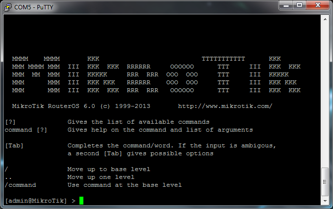
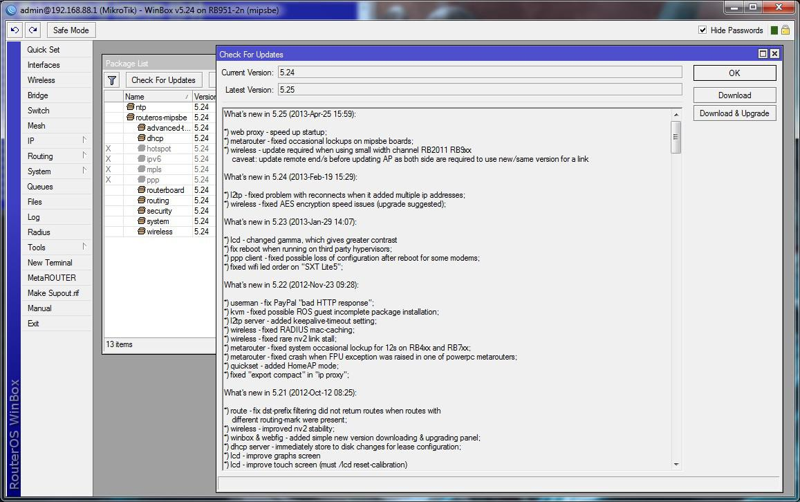
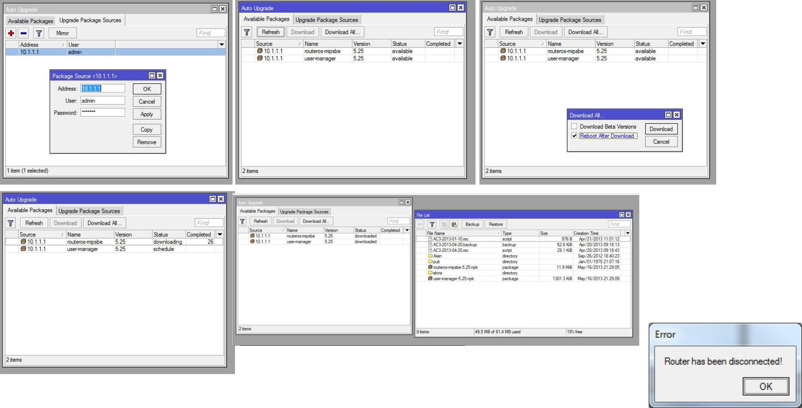
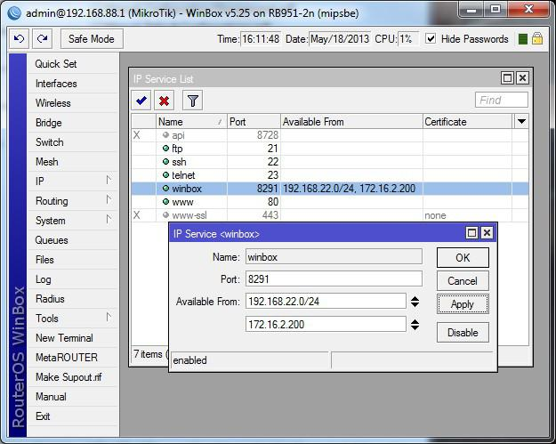
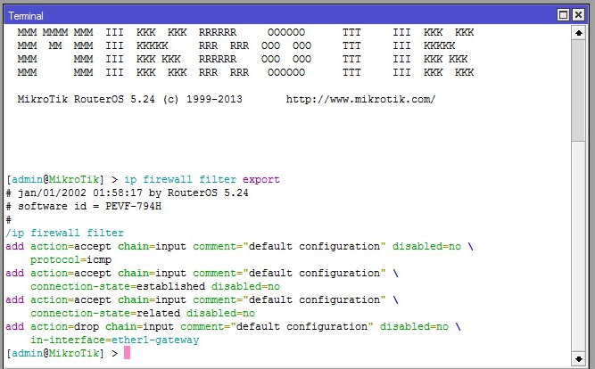

# M1 Intro

## **Для чего нужен курс MTCNA?**

* Знакомство с RouterOS и продуктами RouterBoard.
* Вы получите представление, что можно сделать с помощью RouterOS и продуктов RouterBOARD
* Всё это даст Вам прочную базу и важные знания, которые помогут Вам в работе.

## Цели данного курса:

После изучения курса Вы:

* Будете знакомы с возможностями RouterOS и RouterBoard
* Сможете настраивать, управлять, проводить основную отладку роутеров MikroTik
* Сможете предоставлять основные сервисы клиентам

## Введение

### **Модуль 1**

#### **RouterOS и RouterBoard**

Что такое RouterOS?

* MikroTik RouterOS - это операционная система, на которой работают все продукты MikroTik RouterBOARD.
* Содержит все необходимые возможности для провайдеров и сетевых администраторов: роутинг, фаервол, контроль скорости доступа, резервирование канала, точка доступа, хотспот, VPN сервер и другие.
* RouterOS - операционная система с простым и удобым интерфейсом. Она основана на ядре Linux и её установка не составит сложностей и не займёт много времени.


Что такое RouterBOARD?

* Семейство оборудования, созданное MikroTik. Оно покрывает нужды пользователей по всему миру.
* Все RouterBOARDы работают на RouterOS.


routerboard.com

### Готовые решения

* Это оборудование поставляется в собранном виде, в корпусе и с блоком питания
* Готово к использованию и преднастроенно для большинства конфигураций
* Всё, что нужно сделать - включить его в розетку и подключить к интернету или корпроративной сети.

#### RouterBOARD \(только платы\)

* Небольшие материнские платы, которые продаются "как есть". Вам нужно покупать для них корпус, блок питания и интерфейсы по отдельности. Подходят для сбора индивидуальной конфигурации, т.к. предлагается огромное количество вариантов кастомизации.

#### Корпуса

* Внутренние и внешние корпуса для Ваших RouterBOARDs.

Выбирайте, исходя из:

* места размещения роутера
* модели RouterBOARD
* типов подключения \(USB, антенны и т.д.\).

#### Интерфейсы

* Модули Ethernet, SFP или беспроводные интерфейсы, чтобы расширить функционал RouterBOARD и компьютеров с RouterOS.
* Опять же, выбирайте, отталкиваясь от Ваших нужд и задач.

#### Аксессуары

* Продукты, которые сделаны для MikroTik - блоки питания, крепежи, антенны и PoE инжекторы.

#### MFM

* С программой MFM \(Made for Mikrotik\), сторонние организации предоставляют возможности улучшить Ваш роутер

Почему готовые решения?

* Подходят под большинство запросов
* Некоторые возможности расширения
* Фиксированная конфигурация
* Простое, но надёжное решение для многих задач.

#### Готовые решения. Примеры:

**RB951G-2HnD**

\*\*\*\*\*\*\*\*

* Подходит для дома и малого офиса
* 5 Gig ports
* Встроенный Wi-Fi \(2,4GHz\)
* Лицензия: level 4

**SXT Sixpack**


\(1 OmniTIK U-5HnD with 5 SXT-5HPnD\)

* Good for WISP or company with branch offices
* 5 100Mbps ports \(OmniTik\)
* 5GHz 802.11a/n radios
* Can cover 5Km between central and satellite sites

**CCR1036-12G-4S Cloud Router**


_**Флагманская модель**_

* Роутер для провайдеров или корпоративных сетей
* Rack mount корпус высотой в 1 юнит
* 12 Gig портов
* Serial console, USB и цветной сенсорный экран
* Изначально 4G RAM, расширяется с помощью модулей SO-DIMM RAM

На заметку:

* Название соответствует возможностям роутера. Примеры:
  * CCR : Cloud Core Router
  * RB : RouterBoard
  * 2, 5 : 2,4GHZ or 5GHz wifi radio
  * H : High powered radio
  * S : SFP
  * U : USB
  * i : Injector
  * G : Gigabit ethernet

Зачем создавать свой собственный маршрутизатор?

* Сможете адресовать большое разнообразие потребностей
* Множество дополнительных опций/расширений
* Настраиваемая конфигурация
* Может быть встроено в оборудование или шкаф клиента
* Более полное решение для конкретных потребностей

Собственный роутер. Пример:

#### **Гибкое CPE**


* **RB411UAHR**
  * – 1 порт 100Mbps
  * – 1 2,4GHz radio \(b/g\)
  * – Лицензия Level 4
* Добавим блок питания
* Добавим корпус 3rd ****party
* Добавим miniPCIe-3g-модем

#### **Мощный хотспот**

* Запустите


* **RB493G**
  * 9 gig портов
  * лицензия Level 5
* Добавим электропитание или модуль PoE
* Добавим R2SHPn \(радиокарта 2,4GHz\)
* Добавим R5SHPn \(радиокарта 5GHz\)
* Добавим стороннее приложение
* Добавим карту microSD

## **Первоначальный доступ на роутер**

### Через интернет-браузер

* "Интуитивно понятный" способ доступа к роутеру

Доступ через интернет-браузер

* Подключитесь к роутеру патчкордом
* Запустите браузер
* Введите IP-адрес роутера
* Если потребуется, введите данные для входа. По умолчанию пользователь "admin", пароля нет


* Вы увидите:


### WinBox и MAC-Winbox

* WinBox – проприеритарный интерфейс MikroTik для настройки RouterOS.
* Доступен для загрузке на сайте mikrotik.com/download либо непосредственно с роутера.
* Использует IP \(3 уровень OSI\) или MAC \(2 уровень OSI\) для доступа к роутеру.
* Находясь в веб-интерфейсе, нажмите “logout”
* Нажмите на “Winbox”
* Сохраните “winbox.exe”


* Запустите WinBox.
* Введите IP 192.168.88.1 и нажмите "Connect".
* Вы увидите окно первого запуска


Меню WinBox’а

* Потратьте 5 минут, чтобы пройтись по меню
* Обратите особое внимание на:
  * – IP -&gt; Addresses
  * – IP -&gt; Routes
  * – System -&gt; SNTP
  * – System -&gt; Packages
  * – System -&gt; Routerboard

### Console port



* Обязательно изучите статью: [http://wiki.mikrotik.com/wiki/Serial\_Port\_Usage](http://wiki.mikrotik.com/wiki/Serial_Port_Usage)
* Необходим для подключения к роутеру через нуль-модемный кабель \(RS-232 port\).
  * Значение по-умолчанию 115200 бит/с, данные 8 bit, 1 stop bit, no parity \(отсутствие четности\)

### SSH и Telnet

* Стандартные IP утилиты для доступа к роутеру
* Telnet соединения не шифруются
  * – Доступно на большинстве ОС
  * – Незащищено!!
* SSH соединения зашифрованы
  * – Безопасно!!
  * – Много Open Source утилит доступно, например, PuTTY \([http://www.putty.org/](http://www.putty.org/)\)

### CLI

* Сокращение от **C**ommand **L**ine **I**nterface
* Мы его видим, когда подключаемся через консоль, SSH, Telnet, или нажимаем New Terminal \(в Winbox\)
* Если планируете использовать скрипты и автоматизацию – обязательно к изучению.

## **Первоначальная конфигурация \(Internet access\)**

### Basic или blank конфигурация?

* После распаковки роутера у вас стандартная конфигурация, но её может и не быть \(зависит от модели\)
* Можно отказаться от применения стандартной конфигурации
* Узнать, что настроено по умолчанию на вашем роутере можно по ссылке:
  * [http://wiki.mikrotik.com/wiki/Manual:Default\_Configurations](http://wiki.mikrotik.com/wiki/Manual:Default_Configurations)

### Базовая конфигурация

* В зависимости от модели, будет стандартная конфигурация, которая может включать в себя:

  * WAN порт
  * LAN порт\(ы\)
  * DHCP клиент \(WAN\) и сервер \(LAN\)
  * Базовая настройка фаервола
  * Правило NAT
  * Стандартный LAN IP адрес

* Подключаясь впервые по Winbox'у, нажмите “OK”
* Роутер применит конфигурацию по умолчанию.


### Blank-конфигурация

* Используется в тех случаях, когда стандартная конфигурация не требуется
  * Не нужен фаервол
  * Не нужен NAT
* Минимальная настройка для доступа в интернет \(если на роутере нет default-конфигурации\):
  * LAN IP адрес, ДНС-сервер
  * WAN IP адрес, маршрут по-умолчанию
  * Правило NAT \(masquerade\)
  * SNTP клиент и часовой пояс

## **Обновление роутера**

### Когда необходимо обновление

* Исправлен известный баг.
* Нужна новая функция.
* Улучшена производительность.


**ПРИМЕЧАНИЕ: ПОЖАЛУЙСТА, прочитайте список изменений!!**


Что нового в 5.25 \(2013-Apr-25 15:59\):

\*\) web proxy - ускорен запуск;

\*\) metarouter - исправлены случайные блокировки на платах mipsbe;

\*\) wireless - обновление требуется при использовании канала малой ширины RB2011 RB9xx

предостережение: обновите удаленный конец\(цы\) перед обновлением AP, поскольку обе стороны должны использовать новую/ту же версию для ссылки

### Порядок

* Требует планирования.
  * Шаги должны быть выполнены в точном порядке.
* Требует тестирования
  *  И тестирования…
  * И, да, тестирования!

#### Перед обновлением

* Знайте какую архитектуру \(_mipsbe, ppc,_ _x86, mipsle, tile_\) вы обновляете.
  * Если вы сомневаетесь, Winbox указывает на архитектуру в верхнем левом углу!
* Знайте, какие файлы вам нужны:
  * _NPK : базовый образ RouterOS со стандартными пакетами \(всегда\)_
  * _ZIP : дополнительные пакеты \(в зависимости от потребностей\)_
  * _Changelog : указывает что как изменилось и специальные показатели \(всегда\)_

#### Как обновить

* Получить файлы пакета с сайта MikroTik
  * Страница загрузки


* Три пути
  * Скачать файл\(ы\) и скопировать на маршрутизатор.
  * “Check for updates” \(System -&gt; Packages\)
  * Auto Upgrade \(System -&gt; Auto Upgrade\) \(Автообновление\)

Загрузка файлов

* Скопируйте файлы на маршрутизатор через окно "Files". Примеры:
  * _routeros-mipsbe-5.25.npk_
  * _ntp-5.25-mipsbe.npk_
* Перезагрузить
* Проверить состояние маршрутизатора

#### Проверка наличия обновлений \(с пакетами /system\)

* Через меню “System -&gt; Packages”
* Кликните “Check for Updates”, затем “Download & Upgrade”
* Перезагружается автоматически
* Проверка пакетов и состояния маршрутизатора



#### Автообновление

* Копирование необходимых файлов всеми маршрутизаторами на внутренний маршрутизатор \(источник\).
* Настройка всех маршрутизаторов для указания исходного маршрутизатора
* Отображение доступных пакетов
* Выбор и загрузка пакетов
* Перезагрузка и проверка маршрутизатора



#### Обновление прошивки RouterBOOT

* Проверьте текущую версию
* \[admin@MikroTik\] &gt; /system routerboard print
*     routerboard: yes
*         model: 951-2n
*     serial-number: 35F60246052A
*   current-firmware: 3.02
*   upgrade-firmware: 3.05
* \[admin@MikroTik\] &gt;


* Обновление при необходимости \(_в данном примере_\)

```text
[admin@MikroTik] > /system routerboard upgrade 
Do you really want to upgrade firmware? [y/n] y
firmware upgraded successfully, please reboot for changes to take effect!
[admin@MikroTik] > /system reboot
Reboot, yes? [y/N]:
```

## **Управление логинами RouterOS**

### Учетные записи пользователей

* Создание учетных записей пользователей для
  * Управления привилегиями
  * Логирования действий пользователя
* Создание групп пользователей для
  * Обладают большей гибкостью при назначении привилегий


## **Управление службами RouterOS**

### Службы IP

* Управление службами IP:
  * Ограничение использования ресурсов \(ЦП, память\)
  * Ограничение угроз безопасности \(открытые порты\)
  * Изменение TCP-портов
  * Ограничение одобренных IP-адресов/IP-подсетей
* Для управления службами перейдите в раздел “IP -&gt; Services”
* Отключите или включите необходимые службы.


### Доступ к службам IP

* Дважды щелкните на службе
* При необходимости укажите, какие узлы или подсети могут получить доступ к службе
  * Хорошая практика, чтобы ограничить определенные сервисы для сетевых администраторов



## Управление резервными копиями конфигурации

### Типы резервных копий

* двоичное резервное копирования
* экспорт конфигурации

### Двоичное резервное копирование

* Полное резервное копирование системы
* Включает пароли
* Предполагается, что восстановление будет на том же маршрутизаторе


### Export files



* Полная или частичная конфигурация
* Создает файл скрипта или отправляет на экран
* Используйте " compact” для отображения только нестандартных конфигураций \(по умолчанию на ROS 6\)
* Используйте "verbose", чтобы показать конфигурации по умолчанию

### Архивирование файлов резервных копий

* После создания скопируйте их на сервер
  * Через SFTP \(безопасный метод\)
  * Через FTP, если он включен в IP Services
  * Используя перетаскивание из окна “Files”
* Оставлять резервные копии файлов на маршрутизаторе не очень хорошая стратегия архивирования
  * No tape or CD backups are made of routers

## **Лицензии RouterOS**

### Уровни лицензий

* 6 уровней лицензий
  * 0 : Демо \(24 часа\)
  * 1 : Free \(весьма ограничена\)
  * 3 : WISP CPE \(Wi-Fi клиент\)
  * 4 : WISP \(требуется для запуска точки доступа\)
  * 5 : WISP \(более производительная\)
  * 6 : Controller \(неограниченные возможности\)

### Лицензии

* Определяет допустимую производительность маршрутизатора.
* RouterBOARD поставляется с предустановленной лицензией.
  * Уровни варьируются
* Лицензии должны быть приобретены для системы X86.
  * Одна лицензия действительна только для одной машины.

### Обновление лицензий

* Уровни описаны на веб-странице

[http://wiki.mikrotik.com/wiki/Manual:License](http://wiki.mikrotik.com/wiki/Manual:License)

* Типовое применение
  * Level 3: CPE, беспроводной клиент
  * Level 4: WISP
  * Level 5: Большой WISP
  * Level 6: внутренняя инфраструктура интернет-провайдера \(ядро облака\)

### Использование лицензий

* Купите нужное устройство/лицензию с самого начала.
* Лицензия привязана к диску, на котором она установлена. Будьте осторожны, чтобы не отформатировать диск с помощью инструментов не Mikrotik.
* Прочитайте веб-страницу лицензии для получения более подробной информации!

## **Сетевая установка**

### Использование сетевой установки

* Переустановка RouterOS если исходный образ был поврежден
* Переустановка RouterOS, если пароль ”admin" был потерян
* Вы можете найти на веб-сайте MikroTik на вкладке загрузки

### Процедура без COM-порта

Для RB без COM-порта.

* Подключите компьютер к **порту Ethernet 1**
  * Дайте компьютеру статический IP-адрес и маску
* Запустите Netinstall
  * Нажмите на кнопку " Net booting” и напишите случайный IP-адрес в той же подсети, что и компьютер
* В разделе “Packages”, нажмите “Browse” и выберите каталог, содержащий допустимые файлы NPK
* Нажмите кнопку "reset", пока светодиод " ACT " не погаснет
  * Маршрутизатор появится в разделе "Routers/Drives"
  * Выберите его!
* Выберите необходимую версию RouterOS из раздела "Packages"
  * Кнопка “Install” станет доступной; нажмите её!
* Прогресс-бар будет закрашиваться в синий цвет пока файл NPK будет передаваться
* После завершения подсоедините компьютерный кабель к одному из допустимых портов и кабель доступа в Интернет к порту 1
* Используйте MAC-Winbox для подключения, поскольку конфигурация будет пустой
  * Даже если было выбрано "Keep old configuration"!!
* Загрузите резервную копию конфигурации и перезагрузите
  * \(вот в чем важность правильного управления резервным копированием!\)
* Если проблема заключалась в утерянном пароле, переделайте конфигурацию с нуля, так как при резервном копировании будет использоваться тот же _**забытый**_ пароль \(при этом важна правильность управления доступом!\)

### Процедура с COM-портом

Для RB с COM-портом

* Она начинается \(почти\) так же
  * ПК в **порт Ethernet 1** со статическим адресом
  * Подключить серийный порт ПК к консольному \(COM\) порту RouterBOARD
  * Запустите Netinstall \(и настройте параметр "Net Booting"\)
  * Выберите каталог с файлами NPK
* Перезагрузите маршрутизатор
* Нажмите кнопку "Enter", когда появится запрос, чтобы войти в настройки
* Нажмите “o” для загрузочного устройства
* Нажмите “e” для Ethernet
* Нажмите “x” для выхода из установок \(что перезагрузит маршрутизатор\)
  * Маршрутизатор появится в разделе “Routers/Drives”
  * Select it
* Выберите пакет RouterOS, который будет установлен
  * Нажмите кнопку **“Keep old configuration” \(Сохранить старую конфигурацию\)**
  * Кнопка “Install” становится доступной; нажмите её!
* Прогресс-бар будет закрашиваться в синий цвет пока файл NPK будет передаваться
* После завершения подсоедините компьютерный кабель к одному из допустимых портов и кабель доступа в Интернет к порту 1
* Вы можете использовать Winbox для подключения
  * Опция “Keep old configuration” здесь работает!!
* Перезагрузите маршрутизатор
* Нажмите кнопку "Enter", когда появится запрос, для входа в настройки
* Нажмите “o” для загрузки устройства
* Нажмите “n” для NAND затем Ethernet при сбое
  * **Если вы забыли, вы всегда будете загружаться из Ethernet**
* Нажмите “x” для выхода из настроек \(что перезагрузит маршрутизатор\)

## **Дополнительные ресурсы**

### Wiki

[http://wiki.mikrotik.com/wiki/Manual:TOC](http://wiki.mikrotik.com/wiki/Manual:TOC)

* RouterOS главная страница Вики
* Документация по всем командам маршрутизаторов
  * Пояснение
  * Синтаксис
  * Примеры
* Дополнительные советы и рекомендации

### Tiktube

[http://www.tiktube.com/](http://www.tiktube.com/)

* Видео ресурсы на различные темы
* Представления тренеров, партнеров, интернет-провайдеров и др.
* Может включать в себя презентации слайдов
* Различные языки

### Форум

[http://forum.mikrotik.com/](http://forum.mikrotik.com/)

* Модерируется сотрудниками Mikrotik
* Дискуссии по различным темам
* Много информации можно найти здесь
  * Вы можете найти решение своей проблемы!
* Пожалуйста, воспользуйтесь поиском ПЕРЕД размещением вопроса
  * Стандартный этикет форума

### Поддержка Mikrotik

[support@mikrotik.com](mailto:support@mikrotik.com)

* Процедуры поддержки описанны в [http://](http://www.mikrotik.com/support.html) [www.mikrotik.com/support.html](http://www.mikrotik.com/support.html)
* Поддержка от Mikrotik в течение 15 дней \(уровень лицензии 4\) и 30 дней \(уровень лицензии 5 и уровень 6\), если маршрутизатор куплен у них

### Дистрибьюторская/консультационная поддержка

* Поддержка предоставляется дистрибьютором при покупке маршрутизатора у них
* Сертифицированные консультанты могут быть наняты для особых нужд. Посетите [http://](http://www.mikrotik.com/consultants.html) [www.mikrotik.com/consultants.html](http://www.mikrotik.com/consultants.html) для получения дополнительной информации

Время для практических занятий

## Лаботаторка

* Цель лабораторной работы
  * Ознакомление студентов с методами доступа
  * Настройка доступа в интернет
  * Обновление маршрутизатора на текущую RouterOS
  * Создание группы ограниченного доступа, назначение ей пользователя
  * Управление IP-службами
  * Создание резервной копии текущей конфигурации и восстановление ее после сброса настроек

Лабораторка: Установка


Лабораторка: шаг 1

* Настройка компьютера со статическим IP-адресом вашего модуля
  * Укажите маску подсети
  * Укажите шлюз по умолчанию \(ваш маршрутизатор\)
  * Укажите DNS-сервер \(маршрутизатор\)
* Сделайте Netinstall на ROS 6
* После перезагрузки подключиться к нему таким образом, что позволит вам полный доступ


Лабораторка: шаг 2

* Настройка LAN IP-адреса маршрутизатора
* Настройка WAN IP-адреса маршрутизатора
* Настройка правила NAT маршрутизатора
* Настройка DNS-сервера маршрутизатора
* Настройка маршрута по умолчанию для маршрутизатора\*

Лабораторка: шаг 3

* Добавить группу под названием “minimal”
  * Дайте ей права” telnet“, ”read“ и ”winbox"
  * Объясните эти права
* Добавьте пользователя и дайте ему свое имя
  * Назначьте ему группу "minimal"
  * Назначьте ему пароль
* Назначьте пароль для “администратора”
  * Дайте ему "pod_X_“, где "_X_" - номер вашего модуля
  * Откройте новый терминал. Что произошло?

Лабораторка: шаг 4

* Убедитесь, что прошивка RouterBOARD обновлена.
* Скопируйте пакет NTP \(файл NPK\)
  * Check System -&gt; SNTP Client
  * Check System -&gt; NTP Client and NTP Server
  * Что произошло
* Как только перезагрзится
  * Check System -&gt; SNTP Client
  * Check System -&gt; NTP Client and NTP Server
* Настройка NTP-клиента и часового пояса

Лабораторка: шаг 5

* Студенты подключатся через телнет к маршрутизатору
* Студенты отключат эти IP-сервисы:
  * Telnet
  * WWW
* Студенты будут подключаться к маршрутизатору с помощью Telnet, веб-браузера и SSH
  * Объясните результаты

Лабораторка: шаг 6

* Откройте “New Terminal” и окно “Files”
* Экспортируйте конфигурацию из корня в файл с именем “module1-pod_X_”
* Сделайте двоичное резервное копирование
* Скопируйте оба файла на компьютер
  * Откройте их оба и просмотрите содержимое
  * Удалите правило NAT и используйте ”экспортированный" файл, чтобы быстро его воссоздать

Лабораторка: шаг 7

* Просмотр лицензии routerBOARD
  * Проверьте уровень маршрутизатора и укажите его назначение
  * Как группа обсудите потенциальные возможности использования этого уровня лицензии

