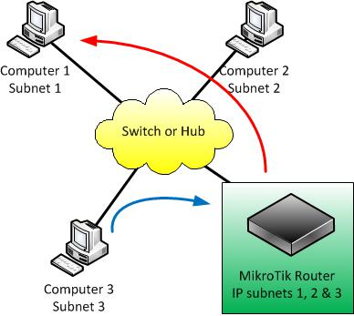

# M2 Routing

## **Обзор маршрутизации**

Концепции маршрутизации

* Маршрутизация-это процесс уровня 3 в модели OSI ISO.
* Маршрутизация определяет, куда перенаправляется \(отправляется\) трафик.
* Она необходима чтобы разрешить различные подсети для обмена данными.
  * Даже если они должны быть на одном “проводе”

### Концепции маршрутизации, пример 1

* Компьютеры не будут взаимодействовать

### Концепции маршршутизации, пример 2

* Компьютеры теперь могут взаимодействовать

Флаги маршрута

* Маршруты имеют статусы. В этом курсе мы ознакомимся со следующим:
  * X: Disabled \(отключен\)
  * A : Active \(активен\)
  * D : Dynamic \(динамический\)
  * C : Connected \(подключен\)
  * S : Static \(статичен\)

Флаги маршрута

* **Disabled** : маршрут отключен. Не имеет никакого влияния на процесс маршрутизации.
* **Active** : маршрут активен и используется в процессе маршрутизации.
* **Dynamic** : маршрут был создан процессом маршрутизации, а не через интерфейс управления.
* **Connected** : маршруты создаются для каждой IP-подсети, которая имеет активный интерфейс на маршрутизаторе.
* **Static** : маршрут, созданный для принудительной пересылки пакетов через определенный .

## **Статическая маршрутизация**

Статический маршрут

* Маршруты к подсетям, которые существуют на маршрутизаторе, автоматически создаются и известны **этим** маршрутизаторам. Но что произойдет, если вам нужно добраться до подсети, которая существует на другом маршрутизаторе? Вы создаете статический маршрут!
* Статический маршрут-это ручной способ пересылки трафика в неизвестные подсети.

Статический маршрут

* Понимание полей
  * **Flags** : состояние каждого маршрута, как описано в предыдущих слайдах
  * **Dst. Address** : адреса назначения, для которых используется этот маршрут.
  * **Gateway** : как правило, IP-адрес следующего маршрутизатора, который будет получать пакеты, предназначенные для “_**Dst. Address**_”.
  * **Distance** : значение, используемое для выбора маршрута. В конфигурациях, где возможны различные дистанции, выбирается маршрут с наименьшим значением.

### Зачем использовать статическую маршрутизацию

* Делает конфигурацию проще для очень маленькой сети, которая, скорее всего, не будет расти.
* Ограничивает использование ресурсов маршрутизатора \(память, процессор\)

### Ограничения статической маршрутизации

* Не очень хорошо масштабируется.
* Ручная настройка требуется каждый раз, когда требуется достичь новой подсети.

#### Ограничения статической маршрутизации, пример

Ваша сеть растет, и вам нужно добавить ссылки на удаленные маршрутизаторы \(и подсети\).

* Предположим, что все маршрутизаторы имеют 2 подсети LAN и 1 или более подсетей WAN

Сколько статических маршрутов добавить на роутер-1?

* Маршрутизаторы с 3 по 5 : 9
* Маршрутизатор 2 : 2
* Маршрутизатор 6 и 7 : 4

**Всего 15 статических маршрутов для добавления вручную!!**

### Создание маршрутов

* Добавление статического маршрута :
  * IP -&gt; Routes
  * \(Add\)
  * Укажите подсеть назначения и маску
  * Укажите “Gateway” \(следующий маршрутизатор\)

### Установка маршрута по-умолчанию

* Маршрут 0.0.0.0/0
  * Известен как **Default route \(Маршрут по-умолчанию\)**.
  * Это место назначения, куда будет перенаправляться весь трафик в неизвестные подсети.
  * Это также статический маршрут.

### Управление динамическими маршрутами

* Как упоминалось ранее, динамические маршруты добавляются процессом маршрутизации, а не администратором.
* Это делается автоматически.
* Вы не можете управлять динамическими маршрутами. Если интерфейс, с которым связан динамический маршрут, отключается, тоже самое происходит и с маршрутом!

#### Управление динамическими маршрутами, пример

Реализация статической маршрутизации в простых сетях

Рассмотрим следующий пример.

* Упражнение:
  * Предполагая, что ip-адреса были правильно введены, какие команды вы бы использовали для включения полной связи для обеих подсетей \(LAN1 и LAN2\)?
  * \(Ответ на следующем слайде. Не расстраивайтесь 🙂\)

* router-1
  * /ip route
  * add gateway=172.22.0.18
  * add dst-address=10.1.2.0/24 gateway=10.0.0.2
* router-2
  * /ip route
  * add gateway=10.0.0.1

## Лабораторка

* Цели лабораторки
  * Получить возможность подключения к другим локальным сетям
  * Проверка использования маршрута по умолчанию
  * Просмотр и объяснение флагов маршрута

Лабораторка: установка

### Лабораторка: шаг 1

* Удалите маршрут по умолчанию, созданный в модуле 1
* Пингуйте компьютеры других POD. Отметьте результаты
* Создайте статические маршруты к подсетям других POD локальной сети
* Пингуйте компьютеры других POD. Отметьте результаты

### Лабораторка: шаг 2

* Откройте веб-браузер и попробуйте получить доступ к веб-странице Mikrotik. Отметьте результаты
* Создайте маршрут по умолчанию, используя маршрутизатор-тренажер в качестве шлюза
* Откройте веб-браузер и попробуйте получить доступ к веб-странице Mikrotik. Отметьте результаты

