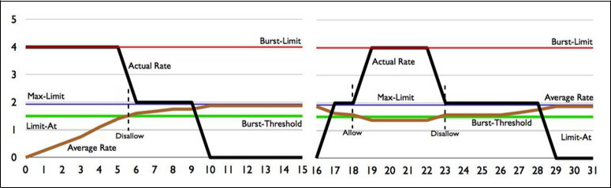

# M3 Bridging

## **Bridging overview**

Bridging concepts

* Bridges are OSI layer 2 devices.
* Traditionally, they were used to join two segments of different \(or similar\) technology.

Bridging concepts

* Bridges were also used to create smaller collision domains.

– The goal was to improve performance by reducing the size of the subnet. Especially useful before the advent of switches.

* Switches are known as multi-port bridges.

– Each port is a collision domain of ONE device!

Example 1

* All computers can communicate with each other.
* All have to wait for everybody to be quiet before one can begin transmitting!

Example 2

* All computers still “hear” each other.
* All computers now only share half the “wire”.
* All still have to wait for everybody to be quiet before one can begin transmitting, but the group is half the size now.

– Better performance for all devices!

Using bridges

* By default, in MikroTik routers, Ethernet ports are associated \(slave\) to a master port.

– Advantage : Wire speed switching \(through switch chip, not software\).

– Disadvantage : No visibility of traffic of slave ports. Not desirable if using SNMP to monitor port usage.

Using bridges

* By removing master and slave configuration, you must use a bridge interface to bundle to it the required ports in a single LAN.

– Advantage : Complete visibility of all port statistics for those ports.

– Disadvantage : Switching done through software. Some CPU hit. Less than optimal packet transfer speed.

Creating bridges

* Using the menus

– Bridge

– Add \(**+**\)

– Name the bridge

– Click “OK” and you’re done!

Creating bridges, example

Adding ports to bridges

* Adding ports will define which ones belong to the same subnet.
* Different technologies can be added, like a Wi-Fi interface.

Adding ports to bridges

* Menu path to add a port

–

–

–

Bridge

Ports tab

Add \(**+**\)

– Choose the interface and the bridge

– Click “OK” and you’re done!

Adding ports to bridges, example

Bridging wireless networks

* The same can be done with wireless interfaces.
* We will see this in the next module. Be patient! 

Time for a practical exercise

**End of module 3**

## Laboratory

* Goals of the lab

– Create a bridge

– Assign ports to a bridge

– Validate that by following these steps, you can assign all free ports to the same subnet

Laboratory : Setup

Laboratory : step 1

* Launch “ping –t –w 500 192.168.0.254”.
* Unplug your network cable from the current port \(\#5\) and plug it in another port.
* Discuss the results.
* Leave the command window up and running and visible throughout this lab.

Laboratory : step 2

* Connect to your router in any way that will work.
* Create a bridge interface. Name it “LAN” and leave the other values at their default.
* Assign the pod’s LAN’s IP address \(192.168.X.1\) to the bridge interface.
* Has anything changed?

Laboratory : step 3

| • | Open the “Interface List” window and check which interfaces are running. |  |  |
| :--- | :--- | :--- | :--- |
| • | Assign ports \#2 through \#5 to the “LAN” bridge interface. |  |  |
| • | Discuss the results. When did your ping return? |  |  |
| • | Switch your cable to ports \#2 through \#5. What happens? Discuss why. Look at the status column. What does “I” mean? |  |  |

**End of Laboratory 3**

