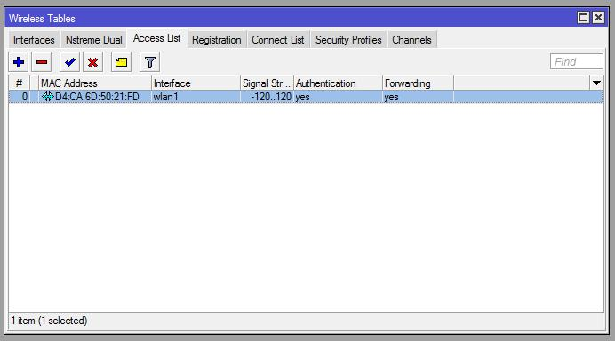
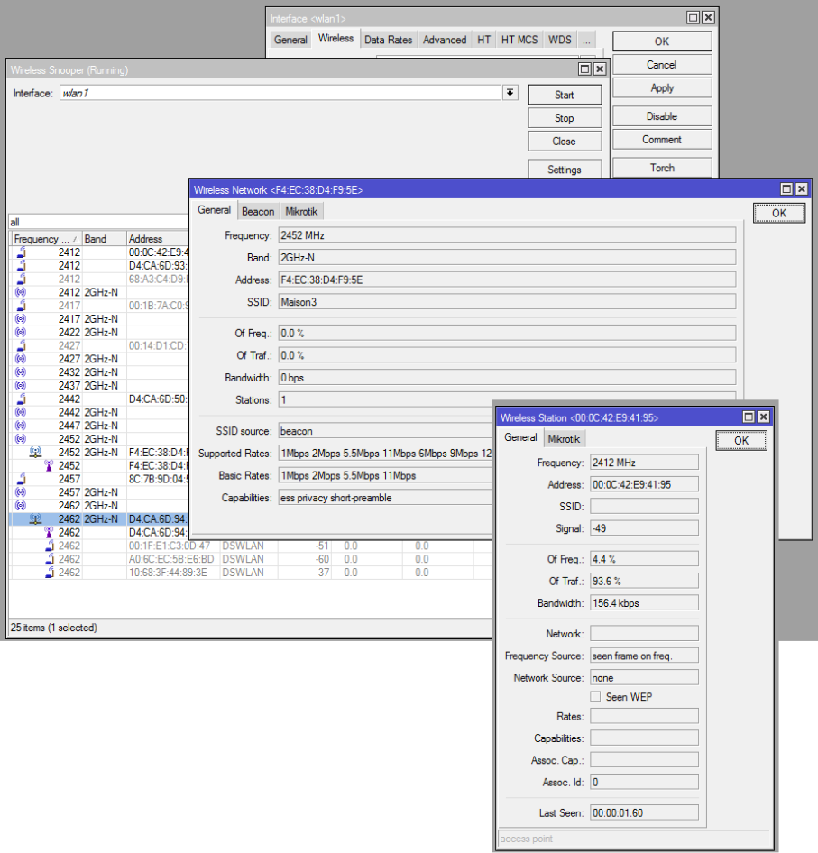
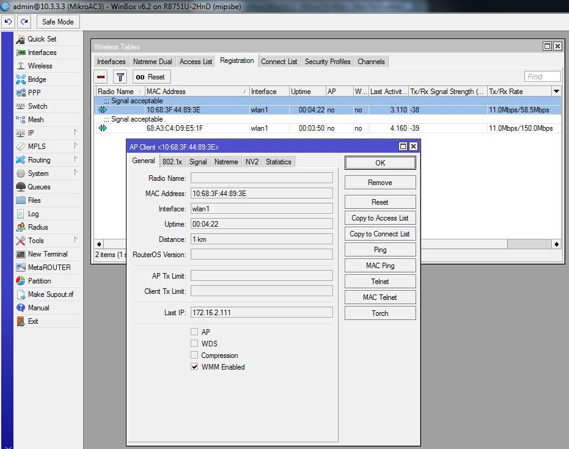

# M4 Wireless

## Концепция **802.11**

### Частоты

* 802.11b
  * 2.4GHz \(ширина полосы 22MHz\), 11Mbps
* 802.11g
  * 2.4GHz \(ширина полосы 22MHz\), 54Mbps
* 802.11a
  * 5GHz \(ширина полосы 20MHz\), 54Mbps
* 802.11n
  * 2.4GHz или 5GHz до 300Mbps, если используется канал 40MHz и 2 радио \(каналы\)

* 802.11b,g диапазон частот
* Каналы 1, 6 и 11 неперекрывающиеся

* 802.11a частотный диапазон
* 12 каналов с шириной 20MHz и 5 с шириной 40MHz
* Диапазон
  * Mikrotik поддерживает оба 5GHz \(802.11a/n\) и 2.4GHz \(802.11b/g/n\)
* Функция “Advanced Channels” предоставляет расширенные возможности в конфигурации беспроводного интерфейса:
  * скан-список, который охватывает несколько полос и широт каналов;
  * нестандартные центральные частоты канала \(заданные с детализацией кГц\) для аппаратных средств, которые позволяют это;
  * нестандартные широты канала \(заданные с детализацией кГц\) для аппаратного обеспечения, которое позволяет это.
* Базовые скорости - это скорости, которые клиент ДОЛЖЕН поддерживать для подключения к точке доступа.
* Поддерживаемые скорости - это скорости, которые могут быть достигнуты после того, как соединение было принято \(факторы могут влиять на максимальную скорость, достигнутую\)
* Скорость передачи данных - это поддерживаемая скорость в соответствии с используемым стандартом.
  * 802.11b: от 1 до 11Mbps
  * 802.11a/g: от 6 до 54Mbps
  * в зависимости от таких факторов, как пропускная способность канала \(20 или 40 МГц\), защитный интервал \(GI\) и цепи
* HT цепи
  * Есть антенны для одного радио
  * Используется для 802.11n и является фактором пропускной способности
* Частотный режим
  * Regulatory-domain: ограничение каналов и мощность передатчика на основе положения страны.
  * Manual-txpower: то же самое, что и выше, но без ограничения мощности TX.
  * Superchannel: будет игнорировать все ограничения
* Параметр “Country”: частоты и ограничения мощности основаны на правилах ”_country_". Использование "_no\_country\_set_" настроит одобренный FCC набор каналов.

## Настройка простой беспроводной связи

* Конфигурация точки доступа
  * Mode : ap bridge
  * Band : основанный на возможностях маршрутизатора и клиентов. Если AP поддерживает несколько полос \(например. B/G/ N\) выберите тот, который лучше всего соответствует вашим потребностям
  * Frequency : любой из доступных каналов \(мы поговорим об этом позже!!\)
  * SSID : идентификатор беспроводной сети для поиска клиентами
  * Wireless protocol : основан на возможностях маршрутизатора и клиентов. Для ”нормальных" соединений AP на ПК используйте 802.11

* **ПОЖАЛУЙСТА**, НАСТРОЙТЕ ПРОФИЛЬ БЕЗОПАСНОСТИ!
  * Не делать этого - полное нарушение безопасности. Это оставляет вашу сеть широко открытой!
* Добавление профиля безопасности
  * Нажмите кнопку “Add” \(+\)
  * Name: Имя профиля
  * Mode: используемый тип аутентификации
  * Authentication types: методы, используемые для проверки подлинности соединения
  * Ciphers: методы шифрования

* Теперь вы можете использовать свой новый профиль безопасности и чувствовать себя в безопасности в своей беспроводной сети

* Вернемся к частотам! Какую из них использовать?
  * Кликните “Snooper”
  * Опасно! Это отключит интерфейс wlan и подключенных клиентов
  * У вас будет полное представление об используемых диапазонах и частотах
  * Выберите свободный канал или, по крайней мере, канал с низким уровнем загруженности

* Конфгурация станции
  * Mode : station
  * Band : В соответствии с вашей точкой доступа
  * Frequency : для клиентов неважно

* Конфигурация станции
  * SSID : должно соответствовать точке доступа, к которой подключаетесь
  * Wireless protocol : должен соответствовать точке доступа, к которой подключаетесь
  * Создайте профиль безопасности, как показано в конфигурации "точка доступа", и примените его здесь. Параметры ДОЛЖНЫ совпадать.

## Фильтрация MAC-адресов

* Фильтрация MAC-адресов является дополнительным способом ограничения соединения с клиентами.
* Чтобы добавить запись в список доступа \(на ТД!!\), выберите зарегистрированный узел и нажмите кнопку “Copy to Access list”

* Теперь у Вас есть новая запись!

Фильтрация MAC-адресов

* Списки доступа используются **на ТД** для ограничения подключений к определенным клиентам и управления их параметрами подключения.
  * Правила проверяются последовательно
  * Применяется только первое совпадающее правило
  * Если параметр “Default Authenticate” \(вкладка _”Wireless“_ на экране _”Interface -&gt; wlan"_\) снята, устройства, не соответствующие правилу списка доступа, отклоняются

* Параметр **Authentication** укажет маршрутизатору проверить "security-profile", чтобы определить, должно ли соединение быть разрешено. Если флажок снят, проверка подлинности всегда завершается ошибкой.
* Параметр Forwarding укажет маршрутизатору, чтобы позволил клиентам ТД связаться друг с другом без помощи ТД \(таким образом, минуя правила брандмауэра, которые у вас могут быть\). Для дополнительной безопасности отключите.
* AP TX Limit ограничивает скорость передачи данных от ТД к клиенту
  * Установка слишком низкого уровня может вызвать проблемы с подключением. Сперва протестируйте!
* Client TX Limit ограничивает скорость передачи данных от клиента к точке доступа
  * Собственное расширение, которое поддерживается только клиентами RouterOS
  * Опять же, вы должны протестировать, чтобы увидеть приемлимое значение

* Connect List \(cписки соединений\) \(на клиентских станциях\) назначают приоритеты на основе параметров уровня сигнала и безопасности, которые определяют, к каким точкам доступа клиент может подключиться
  * Правила проверяются последовательно
  * Применяется только первое совпадающее правило
  * Если опция ”Deafult Authentificate“ \(вкладка _”Wireless“_ на экране _”Interface -&gt; wlan"_\) проверена и не соответствует правилам списка соединений, клиент попытается подключиться на основе лучшей совместимости сигнала и безопасности

* Пример: У этой станции не определены **SSID** или **Security** **profile**, но поскольку у нее есть соответствие списка соединений, соединение было установлено

* **Интересное замечание**: Если поле SSID \(_в правилах подключения станции_\) пусто, клиент подключится к любому SSID с соответствующим **Security profile**.
* Поле SSID интерфейса так же должно быть пустым!

* Default-authentication : задает поведение после проверки списков доступа и подключения.
  * Для точек доступа, если установлено в yes - разрешит соединение, если нет соответствия в списке доступа, предоставленного интерфейсу SSID и соответствия профиля безопасности. В противном случае никакие соединения не допускаются.
  * Для станций, если задано значение yes, будут разрешены соединения, если нет совпадения в списке соединений, предоставленного интерфейсу SSID и профиля безопасности. В противном случае никакие связи не допускаются.
  * Если у ТД нет списка доступа и default-authenticate не установлено, клиенты никогда не смогут подключиться
  * Если у станции нет списка подключений и default-authenticate не установлен, она никогда не подключится к точке доступа
* Default-forwarding : задает поведение переадресации клиентов после проверки списков доступа.
  * Если установлено значение да, будет разрешена связь 2 уровня между клиентами.
  * Если установлено нет - клиенты будут по-прежнему видеть друг друга \(на уровне 3\), ЕСЛИ это разрешено правилами брандмауэра.

## Безопасность и шифрование беспроводного соединения

* WPA, WPA2
  * Wi-Fi защищенный доступ \(I и II\)
  * Протокол аутентификации, созданный после обнаружения слабых мест в WEP
  * При правильной настройке WPA весьма безопасен
    * Слабые места для атак брутфорсом были обнаружены при использовании WPS \(Wi-Fi Protected Setup\)
    * WPS не используется Mikrotik
* WPA
  * Используется для замены WEP \(найдены слабые места\)
  * Использует TKIP в качестве протокола шифрования
    * Генерирует новый ключ для каждого пакета
* WPA2
  * Использует CCMP в качестве протокола шифрования
    * Основан на AES
    * Сильнее чем TKIP
  * Является обязательным в Wi-Fi сертифицированных устройствах с 2006 года
  * Должен использоваться для достижения более высокой скорости передачи данных, иначе ограничивается 54 Мбит/с \([_http://www.intel.com/support/wireless/wlan/4965agn/sb/cs-025643.htm_](http://www.intel.com/support/wireless/wlan/4965agn/sb/cs-025643.htm)\)
* WPA-Personal
  * Also referred to as WPA-PSK, is designed for small offices and the home
  * Does not require an authentication server
  * Client to AP authentication is based on a 256-bit key generated from a pre-shared key \(PSK\), which can be a password or passphrase, known to both
* WPA-Enterprise
  * Also referred to as WPA-802.1X mode, is designed for enterprise networks
  * Uses EAP for authentication
  * Require a RADIUS authentication server
  * More complicated to deploy, but provides added features such as protection against dictionary attacks on weaker passwords

## MikroTik wireless protocols

* NV2 \(Nstreme Version 2\)
  * A Mikrotik proprietary protocol in it’s second version
  * For use with the Atheros 802.11 wireless chip.
  * Based on TDMA \(_Time Division Multiple_ _Access_\) instead of CSMA \(_Carrier Sense Multiple Access_\)
  * Used to improve performance over long distances
* NV2 benefits
  * Increased speed
  * More client connections in point to multipoint environments \(limit is 511 clients\)
  * Lower latency
  * No distance limitations
  * No penalty for long distances

## Monitoring tools

* There are various tools that will help you analyse what’s in the air so you can choose the frequency with no \(or the least\) interference
* Wireless scan : Two options
  * Frequency usage
  * Scan

* Wireless scan : Frequency Usage
  * Shows all supported frequencies and their usage by neighboring APs
  * **Drops** **connected wireless clients!**

* Wireless scan : Scan
  * Gives information about neighboring APs
  * **Drops** **connected wireless clients!**

* Snooper
  * Gives more detailed information about other APs AND clients
  * **Drops connected** **wireless clients!**

* Snooper
  * Gives more detailed information about other Aps AND stations by double-clicking
* Registration table : Used to get information on connected client stations.
  * Useful only on access points.

* Registration table
  * We can see current station connection status
  * Note : Comments appearing above stations is from “Access List” tab. Useful to see under which criteria station was authorized

## Bridging wireless networks

* Station-bridge : A Mikrotik proprietary mode to create a secure L2 bridge between Mikrotik routers
* Can be used to expand a wireless subnet to many clients

Time for a practical exercise

## Laboratory

* Goals of the lab
  * Use the various tools to analyze used channels and characteristics of wireless networks, APs and stations
  * Configure pod routers as wireless clients to the teacher’s router
  * Configure pod routers as wireless APs
  * Familiarise yourselves with Connect Lists and Access lists

Laboratory : Setup

Laboratory : Preliminary step

* **BEFORE WE DO ANYTHING!!!**
  * Do a binary backup of the current configuration under the name:
    * Module3-pod_X_ where _X_ is your pod number
  * How would you go about doing it?
  * What windows would you open?

### Laboratory : step 1

* Launch, one after the other :
  * Frequency Usage
    * Write down channels with most usage
  * Scan
    * Make a link between frequencies and visible SSIDs
  * Snooper
    * What can you tell from the visible networks?
    * What do the symbols in the left column represent?

### Laboratory : step 2

* Open the “Bridge” window and go to the “Ports” tab
* By using the procedures that we saw in previous modules, add “wlan1” interface to “LAN” bridge.
* Close the “Bridge” window

### Laboratory : step 3

* Open the “Wireless” window and make sure the “wlan1” interface is enabled

### Laboratory : step 4

* Double-click on the interface and go to the “Wireless” tab. Click “Advanced Mode”, then enter the following parameters:
  * Mode : ap bridge
  * Band : 2GHz-B/G/N
  * Channel width : 20MHz
  * Frequency : Odd pods use 2437, even pods use 2462
  * SSID : pod_X_
  * Wireless protocol : 802.11
  * Security Profile : default **\(which would be a** _**BAD**_ **idea any** **other time\)**
  * Frequency Mode : Regulatory-domain
  * Country : &lt;_where you are now_&gt;
  * Default Authenticate is checked

### Laboratory : step 5

* Remove the network cable between your laptop and router. The cable from your router to the teacher’s router must stay
* Set-up you laptop to use your router’s wi-fi parameters
* Ensure that you have wi-fi connectivity
* Connect to the Internet

### Laboratory : step 6

* Do a binary backup of the current configuration under the name:
  * Module4a-pod_X_ where _X_ is your pod number
* From the “File List” window, select module3-pod_X_ and click on the “Restore” button on the top part of the window
* Answer “yes” to reboot the router

### Laboratory : step 7

* Reconnect your laptop’s network cable to your router
* Disconnect your router’s network cable to the teacher’s router
* You should now have no Internet access

### Laboratory : step 8

**Preliminary work**

* IP address for WLAN1
  * 192.168.252.pod_X_
* Enable wlan1 interface if such is not the case
* Security profile
  * Name : WPA2
  * Authentication types : WPA2 PSK
  * Unicast and group ciphers : aes ccm
  * WPA2 pre-shared key : mtcna123!

### Laboratory : step 9

* Activate the “Advanced Mode” in the “Wireless” tab of “Interface &lt;wlan1&gt;”
* We need to connect to the class’s AP. The following parameters MUST be compatible to that of the AP to connect to.
  * Mode : Station
  * Band : 2GHz-only-N
  * SSID : WISP
  * Radio name : WISP-POD_X_
  * Wireless protocol : 802.11
  * Security profile : WPA2

### Laboratory : step 10

* Frequency Mode : regulatory-domain
* Country : Normally, you select the country where the AP will be installed.
* Leave “Default Authenticate” checked for now
* Click OK, and select the “Registration” tab in the “Wireless Tables” window
* Your should see the teacher’s AP appear. If so, you’re connected!
  * **But wait!!!**

### Laboratory : step 11

* Before browsing can work, let’s correct our routing tables.
  * Redefine the default gateway to be 192.168.252.254
  * Redefine the route to your neighbor’s pod’s LAN interface \(192.168._Y_.1\) to go through 192.168.252._Y_
  * Ping your neighbor’s pod’s LAN interface \(192. 168._Y_.1\)
    * What’s the result?

**End of Laboratory 4**

