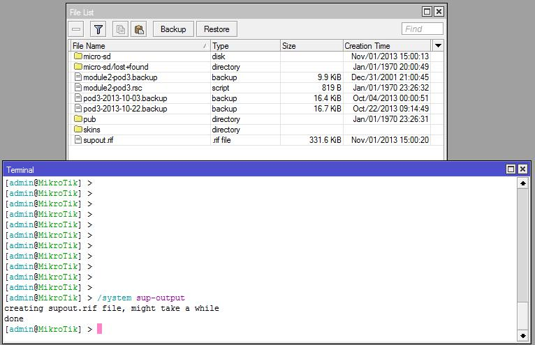

# M5 Network Management

## **ARP**

ARP

* Stands for “Address Resolution Protocol”
* Mechanism that links layer 3 IP address to layer 2 MAC address
* Is normally used as a dynamic process, but can be configured statically in certain situations where security warrants it

ARP modes

* “ARP modes” tell RouterOS how ARP is to work
  * Modes are configured on a “per interface” basis
* The “modes” are
  * **Enabled** : Default mode. ARP requests will be answered and the ARP table will be filled automatically
  * **Disabled** : Interface will not send or reply to ARP requests. Other hosts MUST be told the router’s MAC address
  * **Proxy ARP** : The router answers ARP request coming for it’s directly connected network \(regardless of origin\)
  * **Reply only** : The router answers ARP requests. Router’s ARP table must be filled statically

RouterOS ARP table

* The ARP Table displays all ARP entries and the interface from which they are learned
* The ARP table provides:
  * The IP address of know devices
  * The MAC addresses associated with the IP addresses
  * The interfaces from which they were learned
* You can add static entries to the ARP table to secure your network
  * Can avoid ARP poisoning / ARP spoofing
  * Requires a lot of work and planning

ARP syntax

* View ARP table :
  * /ip arp print
* Add a static entry :
  * /ip arp add address=172.16.2.222 mac-address=11:22:33:44:55:66 interface=Bridge-PC
* Configure ARP mode :
  * /interface ethernet set ether04 arp=proxy-arp

## **DHCP server and client**

DHCP server

* Stands for Dynamic Host Configuration Protocol
* It is used to automatically allocate an IP address, netmask, default gateway and, optionally, other parameters to requesting nodes

DHCP server setup

* The interface hosting the DHCP-server must have it’s own IP address that is NOT in the address pool
  * A pool is a range of IP addresses that will be made available to clients
* In the DHCP-server window, simply click on the “DHCP Setup” button and answer the questions
  * DHCP Server Interface
  * DHCP Address Space
  * Gateway for DHCP Network
  * Addresses to Give Out
  * DNS Servers \(more than one can be entered\)
  * Lease Time
* The automated setup :
  * Creates an IP Pool
    * A pool of IP addresses to assign
  * Creates the DHCP server
    * It’s name and parameters \(such as the interface it will accept requests from\)
  * Creates the address space
    * The IP network and various parameters
* The results of the automated setup

* DHCP can be used to set up options such as
  * 42 : NTP Servers
  * 70 : POP3-Server
  * Visit for more DHCP options
* **Important note**
  * If you have a bridged environment, DHCP Server MUST be set on the bridge interface. If set on a bridge port, the DHCP server will not work.

DHCP server syntax

* Configure a DHCP scope
  * /ip dhcp-server setup
* Configure a DHCP option
  * /ip dhcp-server option add name=46-node-type code=46 value=0x0008
* Assign a DHCP option to a network
  * /ip dhcp-server network print \(_to view_ _available networks_\)
  * /ip dhcp-server network set dhcp-option=46-node-type numbers=1
* Assign a WINS server to a network
  * /ip dhcp-server network set wins-server=172.16.2.100 numbers=1

DHCP server “Networks” configuration

* Example of basic configuration

* Example of expanded configuration

DHCP client

* Allows Ethernet-like interfaces to request an IP address.
  * The remote DHCP server will supply:
    * Address
    * Mask
    * Default gateway
    * Two DNS servers \(if the remote DHCP server is so configured\)
  * The DHCP client will supply configurable options:
    * Hostname
    * Clientid \(in the form of it’s MAC address\)
* Normally used on interfaces facing the Internet, for example

DHCP client syntax

* To configure a DHCP-client interface
  * /ip dhcp-client add interface=ether5 dhcp-options=clientid,hostname
* To view and enable a DHCP client
  * /ip dhcp-client print
  * /ip dhcp-client enable numbers=1
* To view the DHCP client's address
  * /ip address print

Lease management

* The "/ip dhcp-server lease" section provides information about DHCP clients and leases
* Shows dynamic and static leases
* Can turn a dynamic lease into a static one
  * Can be very useful when a device needs to maintain the same IP address
  * Beware! If you change the network card, it will get a new address
* DHCP Server could be made to run only with static addresses
* Clients will only receive the preconfigured IP addresses
* Evaluate your situation and the need to do this before doing it this way. It will require a lot of work for large networks

Lease management syntax

* To view DHCP leases
  * /ip dhcp-server lease print
  * /ip dhcp-server lease print detail \(_gives more_ _detailed information_\)
* To make a dynamic IP address static
  * /ip dhcp-server lease make-static numbers=0
* To modify the previous entry's assigned IP address
  * /ip dhcp-server lease set address=192.168.3.100 numbers=0

## **RouterOS tools**

### E-mail

* A tool that allows you to send e-mail from the router
* It can be used, along with other tools, to send the network administrator regular configuration backups, for example
* Tool CLI path
  * /tools e-mail

#### E-mail, example

* Configure the SMTP server
* /tool e-mail set address=172.31.2.1 from=mymail@gmail.com last-status=succeeded password=never123! \ port=587 start-tls=yes [user=mymail@gmail.com](mailto:user%3Dmymail@gmail.com)
* Send a configuration file via e-mail /export file=export /tool e-mail send to=home@gmail.com subject="$\[/system identity get name\] export"\ body="$\[/system clock get date\] configuration file" file=export.rsc

### Netwatch

* A tool that allows you to monitor the status of network devices
* For each entry, you can specify
  * IP address
  * Ping interval
  * Up and/or Down scripts
* VERY useful to
  * Be made aware of network failures
  * Automate a change of default gateway, for example, should the main router fail
  * Just to have a quick view of what is up
  * Whatever else you can come up with to simplify and speed up your job \(_and make_ _you look efficient!_\)

### Ping

* Basic connectivity tool that uses ICMP Echo messages to determine remote host accessibility and round-trip delay
* One of the first tools to use to troubleshoot. If it pings, the host is alive \(_from a networking point of view_\)
* Use it with other tools when troubleshooting. It's not THE ultimate tool, but a good start

#### Ping syntax

* CLI
* \[admin@MikroAC1\] &gt; ping www.mikrotik.com
* sent=4 received=4 packet-loss=0% min-rtt=156ms avg-rtt=158ms max-rtt=163ms
* HOST                            SIZE TTL TIME STATUS 
* 159.148.147.196        56 50 163ms
* 159.148.147.196        56 50 156ms
* 159.148.147.196        56 50 156ms
* 159.148.147.196        56 50 160ms
* sent=4 received=4 packet-loss=0% min-rtt=156ms avg-rtt=158ms max-rtt=163ms

You’ll need to hit “CTRL-C” to stop the ping

### Traceroute

* Used to display all the routers traveled through to reach your destination
* It indicates the delay to reach each router in the path to reach your destination
* Good to locate a failure or slow node
* CLI

  * /tools traceroute [www.mikrotik.com](http://www.mikrotik.com/) 
  * \[admin@GateWay\] &gt; tool traceroute www.mikrotik.com
  * \#ADDRESS            LOSS SENT LAST   AVG   BEST   WORST STD-DEV STATUS
  * 1 89.179.48.140    0%     20     6.7ms   4.5     1.7 11.6 2.2 
  * 2 89.179.48.166    0%     20     5ms      5.3      2.7 10.6 2.4 
  * 3 213.33.229.109  0%     20     5ms      6.9      1.4 35.9 8.1 
  * 4 213.221.4.132    0%     20     31.6ms 34.5   30.9 39.5 2.1
  * 5 195.13.224.86    0%     19     30.8ms 33.4   30.4 39.4 2.4
  * 6                              100% 19 timeout
  * 7 159.148.147.196 0%    19     33.4ms 32.9   30.9 37.1 1.7

### Profiler \(CPU load\)

* Tool that shows the CPU load
* Shows the processes and their load o the

#### CPU

* Note : “**idle**” is not a process. It means just that; the percentage of the CPU NOT being used
* CLI
  * /tool profile
  * \[admin@MikroAC1\] &gt; /tool profile 
  * NAME CPU USAGE 
  * console all 0% 
  * flash all 0% 
  * networking all 0% 
  * radius all 0% 
  * management all 0.5% 
  * telnet all 0.5% 
  * idle all 99% 
  * profiling all 0% 
  * unclassified all 0% 
  * -- \[Q quit\|D dump\|C-z continue\]

System identity

* Although it is not a tool, it's important to set the system's identity.
  * You can't manage 100 routers that all have the name "MikroTik". It makes troubleshooting almost impossible.
  * Once set, it will make identifying the router you're working on much simpler.
* Syntax
  * /system identity print \(_show current name_\)
  * /system identity set name=my-router \(_sets the_ _router's name_\)

## **Contacting Mikrotik support**

### Supout.rif

* Supout.rif is a support file used for RouterOS debugging purposes and to help Mikrotik support personnel resolve issues faster
* Syntax
  * CLI : /system sup-output
* Once generated, the "supout.rif" file will be found in File List

### Supout.rif Viewer

* To access the "supout.rif viewer", access your Mikrotik account
  * You must have an account \(it’s a good idea to have one anyway\)

* The first steps are to locate and upload the file that you generated
* Start browsing all aspects of your configuration
  * The default view is “resource”

### Autosupout.rif

* A file can be generated automatically upon software failure \(ex. kernel panic or the system becomes unresponsive for a minute\)
* Done through the watchdog \(system\)

### System logging and debug logs

* Logging is important to insure a history \(permanent or not\) of router events
* The easiest way to view logs is through the “log” \(Menu\) window
* The CLI equivalent is
  * /log print

#### System logging

* Actions
  * Tasks that the router will undertake with certain events
  * Rules tell the router which “action” to take
  * There are five types of actions, so you can have a very flexible logging system
* Suggestion
  * You should define news “actions” first as custom actions won’t be made available to your “rules” until they are created

System logging

* Actions, examples
* \[admin@MikroAC5\] &gt; /system logging action print
* Flags: \* - default
* \#NAME    TARGET REMOTE
* 0  \* memory memory 
* 1  \* disk disk 
* 2  \* echo echo 
* 3 \* remote remote 172.16.1.105 
* 4 \* webproxy remote 172.16.1.105
* 5 \* firewallJournal remote 172.16.1.105

System logging

* Rules
  * They tell RouterOS what “action” to undertake with a given event \(which is called a “topic”\)
  * You can have more than one rule for a same topic, each rule performing a different “action”
  * You can have one rule with two or more topics, performing an “action”
  * Adding rules is simple, choose one or many topics, name the rule, choose one action. \(This is why it is suggested to create actions first\)

System logging

* Rules, examples
* \[admin@MikroAC5\] &gt; /system logging print
* Flags: X - disabled, I - invalid, \* - default

•

•

\# TOPICS ACTION 0 \* info memory

PREFIX

INF

* !firewall

| • | 1 | \* error | memory | ERR |
| :--- | :--- | :--- | :--- | :--- |
| • | 2 | \* warning | memory | WRN |
| • | 3 | \* critical | memory | CRT |
| • | 4 | firewall | memory | FW |
| • | 5 | firewall | firewallJournal | FW |
| • | 6 | info | remote | INF |

* !firewall

| • | 7 | error | remote | ERR |
| :--- | :--- | :--- | :--- | :--- |
| • | 8 | warning | remote | WRN |
| • | 9 | critical | remote | CRT |
| • | 10 X snmp | memory | SNMP |  |
| • | 11 | web-proxy | webproxy | PROXY |

* !debug

System logging syntax

* View rules

– /system logging print

* View actions

– /system logging action print

* Store firewall messages to a syslog server

– /system logging action

– add bsd-syslog=yes name=firewallJournal remote=172.16.1.105 src-address=10.5.5.5 syslog-facility=local5 target=remote

* Create a rule for firewall topics that will use the previous action

–

–

/system logging

add action=firewallJournal prefix=FW topics=firewall

Where logs are sent

* As stated in “actions”, logs can be found in five places

– Disk : A hard drive on the router

– Echo : The router’s console \(if present\)

– Email : A predefined e-mail account

– Memory : The router’s internal memory \(as seen in the “log” window\)

– Remote : A syslog server

Readable configuration

* AKA “Make it clear!”
* Obscurity is your worst enemy. Keep your configurations clear and readable through **comments**, **names** and **uniformity**

– Comments : Give a simple description of the item

– Names : Make it meaningful

– Uniformity : Do things the same way everywhere

* Why should you do all this?

– For yourself. In the long run, this will simplify your job and make you look efficient \(again\)

Readable configuration

* Examples

Network diagrams

* A well drawn diagram is a must! Even if you start from a humble beginning, your network WILL grow.
* Identify all key components
* Keep the diagram up to date
* It is a major troubleshooting tool.

– Use it to identify potential problem spots

– Using the tools seen if this module \(ping, traceroute\), write down possible issues

Network diagrams

* Example

– All ports are marked, even available ones

– Devices are

identified

– Revision \# is current

Time for a practical exercise

**End of module 5**

## Laboratory

* Goals of the lab

– Practice ARP concepts shown in this module

– Add DHCP \(client and server\) functionality to your router

– Use various troubleshooting tools

Laboratory : Setup

### Laboratory : step 1

* Display the ARP entries of your router

– Identify each entry

– Based on the network diagram, does it make sense? Compare with the port the MAC address was learned

* Validate in which ARP mode your interfaces are
* Add a fake MAC address as if it was learned from the bridge named “LAN”

### Laboratory : step 2

* Add a DHCP client on WLAN1 interface
* Ask the trainer to make a static reservation on his DHCP server. The fourth digit of your IP address must match your pod
* Give the trainer your wlan’s interface MAC address since your router hasn’t been named yet
* Delete your static IP address
* Renew your DHCP client address
* What’s the final address?

### Laboratory : step 3

* Cleanup

– When creating the DHCP client, the option “Add default route” was set to yes. This means that the DHCP client gets a default route dynamically

– Display your routes. What do you see for the default route?

– What should be done now to cleanup this table?

### Laboratory : step 4

* Set up DHCP server for the computers of the “LAN” bridge

– Create the configuration that will ensure

* * * that clients will get an IP address
    * The DNS server is at the same address as the default gateway \(your router\)

– Reconfigure your computer so that it receives an IP address from your router

– Configure your router so that your computer always gets the .20X address \(where X is your pod’s address\)

– What do you have to do to get that address?

### Laboratory : step 5

* Cleanup

– Add a comment to your static address to indicate what the reservation is for

– In the DHCP tab of DHCP Server, give a meaningful name to the DHCP server \(currently named dhcp 1\)

### Laboratory : step 6

* E-mail setup

– Configure your e-mail settings as to allow you to send e-mails to a personal e-mail address.

* * * You can use your own e-mail account to test this out

– Test your configuration with a test e-mail

### Laboratory : step 7

* Netwatch

– Use this tool to monitor a test node supplied by the trainer

– To speed things up, configure monitoring interval at 30 seconds

### Laboratory : step 8

* Netwatch

– Use these scripts:

**Down**

/tool e-mail send to=“&lt;your-e-mail-address&gt;" subject="$\[/system identity get name\] Netwatch status" \ body="$\[/system clock get date\] $\[/system clock get time\] Node down."

/tool e-mail send to="&lt;your-e-mail-address&gt;" subject="$\[/system identity get name\] Netwatch status" \ body="$\[/system clock get date\] $\[/system clock get time\] Node up1."

3

### Laboratory : step 9

* Netwatch

– Turn off the test node. Verify that you receive an e- mail indicating the change of status. It should look something like this

### Laboratory : step 10

* Ping

– Use the ping tool to validate that the test node answers ICMP echo packets

* Traceroute

– Use the traceroute tool to see which hops are between you and the test node. Validate that what you see is what is in the class’ network diagram

### Laboratory : step 11

* Profiler

– Launch the profiling tool and view the various processes running on your router

– What does the highest percentage represent?

* * * Sort tasks by “usage”

### Laboratory : step 12

* Supout.rif

– Create a supout.rif file. Where is it?

– Upload it and take a look at the various sections of your router as viewed by the supout.rif viewer. It’s interesting to see that such a small file can go a long way to help Mikrotik help you.

– Important note : If you don't have a MikroTik account, please create one now as it is required to take the certification exam!!

### Laboratory : step 13

* Logging

– Create an action:

* * * Type is “memory”

– Create a rule:

* * * topics “e-mail” and “debug”
    * Action “action1”

– Open the “log” window

– Go back to the e-mail tool and send yourself a test e-mail. What do you see in the log window?

### Laboratory : step 14

• Cleaning up our configuration

– Go to the logging window, actions tab and rename “action1” to “E-mail-Debug”

– What happened? Rename “action1” to “EmailDebug”

– Switch back to the rules tab. What do you notice about the “e-mail,debug” entry?

• Do a binary backup of your configuration that respects the previous file name structure from the previous module

### Laboratory : step 15

* Lastly, rename your router so that :

– it is named after your pod

– The first letter is capitalized

* Create two backups named Module5-Pod_x_

– one must be binary

– one must be an export

