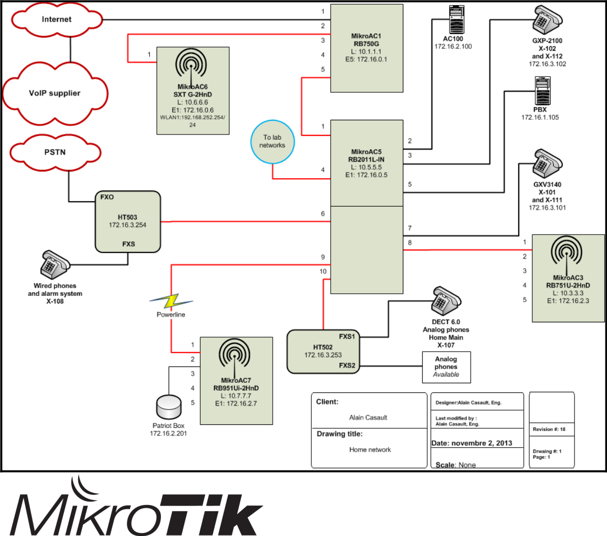

# M5 Network Management

## **ARP**

* Означает “Address Resolution Protocol” - "Протокол определения адреса”
* Механизм, который связывает IP-адрес уровня 3 с MAC-адресом уровня 2
* Обычно используется как динамический процесс, но может быть сконфигурирован статически в определенных ситуациях, когда этого требует безопасность

### Режимы ARP

* "Режимы ARP" расскажут RouterOS, как должен работать ARP
  - Режимы настраиваются по принципу "на интерфейсе".
* "Режимы" могут быть
  - **Enabled**: режим по умолчанию. На запросы ARP будут даны ответы и таблица ARP будет заполнена автоматически
  - **Disabled**: интерфейс не будет отправлять или отвечать на запросы ARP. Другим хостам необходимо сообщить MAC-адрес маршрутизатора
  - **Proxy ARP**: маршрутизатор отвечает на запрос ARP, поступающий для его непосредственно подключенной сети (независимо от источника)
  - **Reply only**: маршрутизатор отвечает на запросы ARP. Таблица ARP маршрутизатора должна быть заполнена статически

### Таблица ARP RouterOS

* Таблица ARP отображает все записи ARP и интерфейс, из которого они извлекаются
* Таблица ARP предоставляет:
  - IP-адрес известных устройств
  - MAC-адреса, связанные с IP-адресами
  - Интерфейсы, с которых они были извлечены
* Вы можете добавить статические записи в таблицу ARP, чтобы защитить свою сеть
  - Может избежать заражения/подмены ARP
  - Требует много работы и планирования

### Синтаксис ARP

* Просмотр таблицы ARP:
  - `/ip arp print`
* Добавить статическую запись:
  -  `/ip arp add address=172.16.2.222 macaddress=11:22:33:44:55:66 interface=Bridge-PC`
* Настройка режима ARP:
  - `/interface ethernet set ether04 arp=proxyarp`

## DHCP сервер и клиент

### DHCP сервер

* Расшифровывается как Dynamic Host Configuration Protocol - протокол динамической настройки узла
* Он используется для автоматического выделения IP-адреса, маски сети, шлюза по умолчанию и, возможно, других параметров запрашиваемых узлом

#### Настройки DHCP-сервера

* Интерфейс, на котором размещается DHCP-сервер, должен иметь собственный IP-адрес, отсутствующий в пуле адресов
  - Пул - это диапазон IP-адресов, которые будут доступны клиентам.

* В окне DHCP-сервера просто нажмите на кнопку "DHCP Setup" и ответьте на вопросы
  - DHCP Server Interface - интерфейс DHCP-сервера
  - DHCP Address Space - адресное пространство dhcp
  - Gateway for DHCP Network - шлюз для DHCP-сети
  - Addresses to Give Out - адреса для выдачи
  - DNS Servers (можно ввести более одного)
  - Lease Time - время аренды

* Автоматическая настройка:
  - Создаем пул IP-адресов:
    - Пул IP-адресов для назначения
  - Создаем DHCP-сервер
    - Его имя и параметры (например, интерфейс, от которого он будет принимать запросы)
  - Создаем адресное пространство:
    - IP-сеть и различные параметры

* Результаты автоматизированной настройки


* DHCP можно использовать для настройки таких параметров, как:
  - 42: серверы NTP
  - 70: POP3-сервер
  - Посетите для получения дополнительных параметров DHCP
* **Важное примечание**
  - Если у вас есть бриджевое пространство, DHCP-сервер должен быть установлен на интерфейсе бриджа. Если он установлен на порту бриджа, DHCP-сервер не будет работать.

#### Синтаксис DHCP-сервера

  * Настройка области DHCP
    - `/ip dhcp-server setup`
  * Настройка параметра DHCP
    - `/ip dhcp-server option add name=46-node-type code=46 value=0x0008`
  * Назначить параметр DHCP для сети
    - `/ip dhcp-server network print` (для просмотра доступных сетей)
    - `/ip dhcp-server network set dhcp-option=46-node-type numbers=1`
  * Назначение WINS-сервера сети
    - `/ip dhcp-server network set wins-server=172.16.2.100 numbers=1`

#### Конфигурация DHCP-сервера “Networks”

* Пример базовой конфигурации


* Пример расширенной конфигурации


### DHCP-клиент

* Позволяет Ethernet-подобным интерфейсам запрашивать IP-адрес.
  * Удаленный DHCP-сервер будет предоставлять:
    * Адрес
    * Маска
    * Шлюз по умолчанию
    * Два DNS-сервера (если удаленный DHCP-сервер настроен таким образом)
  * DHCP-клиент предоставляет настраиваемые параметры:
    * Имя хоста
    * Clientid (в виде его MAC-адреса)
* Обычно используется на интерфейсах, обращенных к Интернету, например


#### Синтаксис DHCP-клиента

* Настройка интерфейса DHCP-клиента
  * `/ip dhcp-client add interface=ether5 dhcp-options=clientid,hostname`
* Просмотр и включение DHCP-клиента
  * `/ip dhcp-client print`
  * `/ip dhcp-client enable numbers=1`
* Просмотр адресов DHCP-клиентов
  * `/ip address print`

#### Управление арендой

* Раздел "/ip dhcp-server lease" содержит информацию о DHCP-клиентах и арендах
* Показывает динамическую и статическую аренду.
* Может превратить динамическую аренду в статическую
  - Может быть очень полезно, когда устройство должно получать один и тот же IP-адрес
  - Осторожно! Если вы замените сетевую карту - она получит новый адрес
* DHCP-сервер можно заставить работать только со статическими адресами
* Клиенты будут получать только предварительно настроенные IP-адреса
* **Оцените свою ситуацию и необходимость в этом прежде, чем делать таким образом. Это потребует много работы для крупных сетей**

##### Синтаксис управления арендой

* Просмотр аренд DHCP
  * `/ip dhcp-server lease print`
  * `/ip dhcp-server lease print detail` \(_gives more_ _detailed information_\)
* Чтобы сделать динамический IP-адрес - статическим
  * `/ip dhcp-server lease make-static numbers=0`
* Изменение назначенного IP-адреса предыдущей записи
  * `/ip dhcp-server lease set address=192.168.3.100 numbers=0`

## Инструменты RouterOS

### E-mail

* Инструмент, позволяющий отправлять электронную почту с маршрутизатора
* Его, например, можно использовать, наряду с другими инструментами, для отправки администратору сети регулярных резервных копий конфигурации
* Путь к инструменту в CLI
  * /tools e-mail

#### E-mail, пример

* Настройка SMTP-сервера
  - `/tool e-mail set address=172.31.2.1 from=mymail@gmail.com last-status=succeeded password=never123! \`
  - `port=587 start-tls=yes user=mymail@gmail.com`
* Отправить конфигурационный файл по электронной почте
  - `/export file=export`
  - `/tool e-mail send to=home@gmail.com subject="$[/system identity get name] export"\`
  - `body="$\[/system clock get date] configuration file" file=export.rsc`

### Netwatch

* Инструмент, позволяющий контролировать состояние сетевых устройств
* Для каждой записи вы можете указать
  - IP-адрес
  - Интервал пинга
  - Скрипты подъема и/или падения
* ОЧЕНЬ полезно
  - Будьте в курсе сетевых сбоев
  - Автоматизировать изменение шлюза по умолчанию, например, в случае сбоя основного маршрутизатора
  - Просто чтобы быстро увидеть, что происходит
- Все, что вы можете придумать, чтобы упростить и ускорить вашу работу (и заставить вас выглядеть эффективно!)

### Ping

* Базовый инструмент связи, использующий эхо-сообщения ICMP для определения доступности удаленного хоста и задержки обратного хода.
* Один из первых инструментов для устранения неполадок. Если он пингует - хост жив _(с точки зрения сети)_
* Используйте его с другими инструментами при устранении неполадок. Это не самый лучший инструмент, но хорошее начало.

#### Синтаксис Ping

* CLI

```
[admin@MikroAC1] > ping www.mikrotik.com
HOST                     SIZE TTL TIME STATUS
159.148.147.196             56 50 163ms
159.148.147.196             56 50 156ms
159.148.147.196             56 50 156ms
159.148.147.196             56 50 160ms
  sent=4 received=4 packet-loss=0% min-rtt=156ms avg-rtt=158ms max-rtt=163ms


You’ll need to hit “CTRL-C” to stop the ping
```

### Traceroute

* Используется для отображения всех маршрутизаторов, пройденных до места назначения
* Указывает на задержку при достижении каждого маршрутизатора в пути по достижению пункта назначения
* Хорош для обнаружения сбоя или медленного узла
* CLI

```
– /tools traceroute www.mikrotik.com
– [admin@GateWay] > tool traceroute www.mikrotik.com
– # ADDRESS             LOSS  SENT  LAST AVG BEST WORST STD-DEV STATUS
– 1 89.179.48.140       0%    20  6.7ms  4.5 1.7 11.6 2.2
– 2 89.179.48.166       0%    20  5ms    5.3 2.7 10.6 2.4
– 3 213.33.229.109      0%    20  5ms    6.9 1.4 35.9 8.1
– 4 213.221.4.132       0%    20  31.6ms 34.5 30.9 39.5 2.1
– 5 195.13.224.86       0%    19  30.8ms 33.4 30.4 39.4 2.4
– 6               100% 19 timeout
– 7 159.148.147.196     0%    19  33.4ms 32.9 30.9 37.1 1.7
```

### Profiler (загрузка ЦП)

* Инструмент, показывающий загрузку процессора
* Показывает процессы и их нагрузку на ЦП
* Примечание: “**idle**” (бездействие) - это не процесс. Это означает именно это; процент неиспользуемого процессора

* CLI

```
– /tool profile
– [admin@MikroAC1] > /tool profile
– NAME        CPU   USAGE
– console     all   0%
– flash       all   0%
– networking  all   0%
– radius      all   0%
– management  all   0.5%
– telnet      all   0.5%
– idle        all   99%
– profiling   all   0%
– unclassified  all 0%
– -- [Q quit|D dump|C-z continue]
```

### Система идентификации

* Хотя это не инструмент, важно установить идентичность системы
  - Вы не можете управлять 100 маршрутизаторами, которые все имеют имя "MikroTik". Это делает устранение неполадок практически невозможным.
  - После установки он значительно упростит идентификацию маршрутизатора, с которым вы работаете.
* Синтаксис
  - `/system identity print` _(показать текущее имя)_
  - `/system identity set name=my-router` (задать имя маршрутизатора)

## Обращение в службу поддержки Mikrotik

### Supout.rif

* Supout.rif это файл поддержки, используемый для отладки RouterOS и помогающий персоналу службы поддержки Mikrotik быстрее решать проблемы
* Синтаксис
  - CLI: `/system sup-output`
* После генерации файл "supout.rif" будет найден в File List


### Supout.rif Viewer

* Чтобы получить доступ к "supout.rif viewer", необходимо иметь доступ к учетной записи Mikrotik
  - У вас должен быть аккаунт _(это хорошая идея, чтобы иметь его в любом случае)_


* Первые шаги - найти и загрузить созданный файл.
* Начните просматривать все аспекты вашей конфигурации.
  - Просмотр по умолчанию - “ресурсы”


### Autosupout.rif

* Файл может быть сгенерирован автоматически при программном сбое (напр. kernel panic или the system becomes unresponsive for a minute)
* Сделано через watchdog (сторожевого пса) (системно)

### Системное логирование и журналы отладки

* Логирование важно для обеспечения истории событий маршрутизатора (постоянной или нет)
* Самый простой способ просмотра журналов - через окно "log" (Меню).
* Эквивалент CLI:
  - /log print


#### System logging

* Actions
  * Tasks that the router will undertake with certain events
  * Rules tell the router which “action” to take
  * There are five types of actions, so you can have a very flexible logging system
* Suggestion
  * You should define news “actions” first as custom actions won’t be made available to your “rules” until they are created

* Actions, examples
* [admin@MikroAC5] &gt; /system logging action print
* Flags: \* - default
* \#NAME    TARGET REMOTE
* 0  \* memory memory
* 1  \* disk disk
* 2  \* echo echo
* 3 \* remote remote 172.16.1.105
* 4 \* webproxy remote 172.16.1.105
* 5 \* firewallJournal remote 172.16.1.105

* Rules
  * They tell RouterOS what “action” to undertake with a given event \(which is called a “topic”\)
  * You can have more than one rule for a same topic, each rule performing a different “action”
  * You can have one rule with two or more topics, performing an “action”
  * Adding rules is simple, choose one or many topics, name the rule, choose one action. \(This is why it is suggested to create actions first\)

* Rules, examples
* \[admin@MikroAC5\] &gt; /system logging print
* Flags: X - disabled, I - invalid, \* - default
* \# TOPICS          ACTION          PREFIX
* 0 \* info              memory          INF
*    !firewall
* 1  _\*_ error           memory          ERR
* 2 __ \* warning     memory          WRN
* 3 \* critical        memory          CRT
* 4   firewall       memory           FW
* 5   firewall      firewallJournal FW
* 6   info             remote             INF
*      !firewall
* 7 error             remote             ERR
* 8 warning       remote             WRN
* 9 critical         remote             CRT
* 10 X snmp     memory          SNMP
* 11 web-proxy webproxy       PROXY
* !debug

System logging syntax

* View rules
  * /system logging print
* View actions
  * /system logging action print
* Store firewall messages to a syslog server
  * /system logging action
  * add bsd-syslog=yes name=firewallJournal remote=172.16.1.105 src-address=10.5.5.5 syslog-facility=local5 target=remote
* Create a rule for firewall topics that will use the previous action
  * /system logging
  * add action=firewallJournal prefix=FW topics=firewall

Where logs are sent

* As stated in “actions”, logs can be found in five places
  * Disk : A hard drive on the router
  * Echo : The router’s console \(if present\)
  * Email : A predefined e-mail account
  * Memory : The router’s internal memory \(as seen in the “log” window\)
  * Remote : A syslog server

Readable configuration

* AKA “Make it clear!”
* Obscurity is your worst enemy. Keep your configurations clear and readable through **comments**, **names** and **uniformity**
  * Comments : Give a simple description of the item
  * Names : Make it meaningful
  * Uniformity : Do things the same way everywhere
* Why should you do all this?
  * For yourself. In the long run, this will simplify your job and make you look efficient \(again\)

Readable configuration

* Examples


Network diagrams

* A well drawn diagram is a must! Even if you start from a humble beginning, your network WILL grow.
* Identify all key components
* Keep the diagram up to date
* It is a major troubleshooting tool.
  * Use it to identify potential problem spots
  * Using the tools seen if this module \(ping, traceroute\), write down possible issues

* Example
  * All ports are marked, even available ones
  * Devices are identified
  * Revision \# is current



Time for a practical exercise

**Конец 5 модуля**

## Лабораторка

* Goals of the lab
  * Practice ARP concepts shown in this module
  * Add DHCP \(client and server\) functionality to your router
  * Use various troubleshooting tools

Лабораторка: Установка


### Лабораторка: шаг 1

* Display the ARP entries of your router
  * Identify each entry
  * Based on the network diagram, does it make sense? Compare with the port the MAC address was learned
* Validate in which ARP mode your interfaces are
* Add a fake MAC address as if it was learned from the bridge named “LAN”

### Лабораторка: шаг 2

* Add a DHCP client on WLAN1 interface
* Ask the trainer to make a static reservation on his DHCP server. The fourth digit of your IP address must match your pod
* Give the trainer your wlan’s interface MAC address since your router hasn’t been named yet
* Delete your static IP address
* Renew your DHCP client address
* What’s the final address?

### Лабораторка: шаг 3

* Cleanup
  * When creating the DHCP client, the option “Add default route” was set to yes. This means that the DHCP client gets a default route dynamically
  * Display your routes. What do you see for the default route?
  * What should be done now to cleanup this table?

### Лабораторка: шаг 4

* Set up DHCP server for the computers of the “LAN” bridge
  * Create the configuration that will ensure
    * that clients will get an IP address
    * The DNS server is at the same address as the default gateway \(your router\)
  * Reconfigure your computer so that it receives an IP address from your router
  * Configure your router so that your computer always gets the .20X address \(where X is your pod’s address\)
  * What do you have to do to get that address?

### Лабораторка: шаг 5

* Cleanup
  * Add a comment to your static address to indicate what the reservation is for
  * In the DHCP tab of DHCP Server, give a meaningful name to the DHCP server \(currently named dhcp 1\)

### Лабораторка: шаг 6

* E-mail setup
  * Configure your e-mail settings as to allow you to send e-mails to a personal e-mail address.
    * You can use your own e-mail account to test this out
  * Test your configuration with a test e-mail

### Лабораторка: шаг 7

* Netwatch
  * Use this tool to monitor a test node supplied by the trainer
  * To speed things up, configure monitoring interval at 30 seconds

### Лабораторка: шаг 8

* Netwatch
  * Use these scripts:

**Down**

```text
/tool e-mail send to=“<your-e-mail-address>" subject="$[/system identity get name] Netwatch status" \
body="$[/system clock get date] $[/system clock get time] Node down."
```

**Up**

```text
/tool e-mail send to="<your-e-mail-address>" subject="$[/system identity get name] Netwatch status" \
body="$[/system clock get date] $[/system clock get time] Node up."
```


### Лабораторка: шаг 9

* Netwatch
  * Turn off the test node. Verify that you receive an e- mail indicating the change of status. It should look something like this


### Лабораторка: шаг 10

* Ping
  * Use the ping tool to validate that the test node answers ICMP echo packets
* Traceroute
  * Use the traceroute tool to see which hops are between you and the test node. Validate that what you see is what is in the class’ network diagram

### Лабораторка: шаг 11

* Profiler
  * Launch the profiling tool and view the various processes running on your router
  * What does the highest percentage represent?
    * Sort tasks by “usage”

### Лабораторка: шаг 12

* Supout.rif
  * Create a supout.rif file. Where is it?
  * Upload it and take a look at the various sections of your router as viewed by the supout.rif viewer. It’s interesting to see that such a small file can go a long way to help Mikrotik help you.
  * Important note : If you don't have a MikroTik account, please create one now as it is required to take the certification exam!!

### Лабораторка: шаг 13

* Logging
  * Create an action:
    * Type is “memory”
  * Create a rule:
    * topics “e-mail” and “debug”
    * Action “action1”
  * Open the “log” window
  * Go back to the e-mail tool and send yourself a test e-mail. What do you see in the log window?

### Лабораторка: шаг 14

* Cleaning up our configuration
  * Go to the logging window, actions tab and rename “action1” to “E-mail-Debug”
  * What happened? Rename “action1” to “EmailDebug”
  * Switch back to the rules tab. What do you notice about the “e-mail,debug” entry?
* Do a binary backup of your configuration that respects the previous file name structure from the previous module

### Лабораторка: шаг 15

* Lastly, rename your router so that:
  * it is named after your pod
  * The first letter is capitalized
* Create two backups named Module5-Pod_x_
  * one must be binary
  * one must be an export
