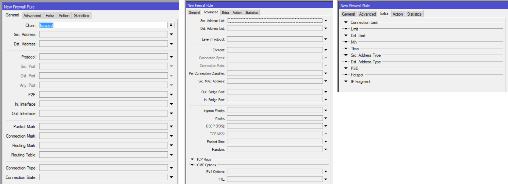

# M6 Firewall

## Принципы брандмауэра (фаерволла)

* Брандмауэр - это служба, которая пропускает или блокирует пакеты данных, идущие к нему или через него на основе определенных пользователем правил.
* Брандмауэр действует как барьер между двумя сетями.
* Общий пример - ваша локальная сеть (доверенная) и Интернет (не доверенная).

### Как работает брандмауэр

* Брандмауэр работает по правилам. Они состоят из двух частей
  - Совпадение: _условия, которые нужны для совпадения_
  - Действие: _что я буду делать, когда у меня будет совпадение_
* Сопоставитель смотрит на такие параметры, как:
  - MAC-адрес источника
  - IP-адреса (сеть или список) и типы адресов (широковещательный, локальный, многоадресный, одноадресный)
  - Порт или диапазон портов
  - Протокол
  - Параметры протокола (поля типа и кода ICMP, флаги TCP, параметры IP)
  - Интерфейс: пакет приходит от или через
  * Байт DSCP
  * _**И многое другое…**_

### Потоки пакетов

* MikroTik создал диаграммы потока пакетов, чтобы помочь нам в создании более продвинутых конфигураций.
* Хорошо быть знакомым с ними, чтобы знать, что происходит с пакетами и в каком порядке
* Для этого курса мы будем держать его простым

* Общие диаграммы


#### Потоки пакетов, пример*

* Сложно? Добро пожаловать в клуб!
* Этот следующий пример может помочь проиллюстрировать простой поток пакетов: Pinging a (несуществующий узел) на интерфейсе локальной сети маршрутизатора через его интерфейс WAN
  - IP узла, выполняющего пинг : 172.16.2.100
  - IP-адрес узла, который пингуется : 192.168.3.2
  - IP WAN маршрутизатора (ether1): 192.168.0.3

**Ping in**

```text
===PREROUTING===
Mangle-prerouting prerouting: in:ether1 out:(none), src-mac d4:ca:6d:33:b5:ef, proto ICMP (type 8, code 0),
172.16.2.100->192.168.3.2, len 60
dstnat dstnat: in:ether1 out:(none), src-mac d4:ca:6d:33:b5:ef, proto ICMP (type 8, code 0), 172.16.2.100-
>192.168.3.2, len 60
===FORWARD===
Mangle-forward forward: in:ether1 out:Bridge-PC, src-mac d4:ca:6d:33:b5:ef, proto ICMP (type 8, code 0),
172.16.2.100->192.168.3.2, len 60
Filter-forward forward: in:ether1 out:Bridge-PC, src-mac d4:ca:6d:33:b5:ef, proto ICMP (type 8, code 0),
172.16.2.100->192.168.3.2, len 60
===POSTROUTING===
Mangle-postrouting postrouting: in:(none) out:Bridge-PC, src-mac d4:ca:6d:33:b5:ef, proto ICMP (type 8, code 0),
172.16.2.100->192.168.3.2, len 60
srcnat srcnat: in:(none) out:Bridge-PC, src-mac d4:ca:6d:33:b5:ef, proto ICMP (type 8, code 0), 172.16.2.100-
>192.168.3.2, len 60
```

**Reply out**

```text
===OUTPUT===
Mangle-output output: in:(none) out:ether1, proto ICMP (type 3, code 1), 192.168.0.3->172.16.2.100, len 88
Filter-output output: in:(none) out:ether1, proto ICMP (type 3, code 1), 192.168.0.3->172.16.2.100, len 88
===POSTROUTING===
Mangle-postrouting postrouting: in:(none) out:ether1, proto ICMP (type 3, code 1), 192.168.0.3->172.16.2.100, len 88
```

#### Потоки пакетов, объяснение примера

```text
/ip firewall filter
add action=log chain=input log-prefix=Filter-input protocol=icmp
add action=log chain=output log-prefix=Filter-output protocol=icmp
add action=log chain=forward log-prefix=Filter-forward protocol=icmp
/ip firewall mangle
add action=log chain=prerouting log-prefix=Mangle-prerouting protocol=icmp
add action=log chain=output log-prefix=Mangle-output protocol=icmp
add action=log chain=input log-prefix=Mangle-input protocol=icmp
add action=log chain=forward log-prefix=Mangle-forward protocol=icmp
add action=log chain=postrouting log-prefix=Mangle-postrouting protocol=icmp
/ip firewall nat
add action=log chain=srcnat log-prefix=srcnat protocol=icmp
add action=log chain=dstnat log-prefix=dstnat protocol=icmp
```

#### Отслеживание соединений и состояний

* Отслеживание соединений управляет информацией обо всех активных соединениях.
* Прежде чем создавать фильтры брандмауэра (или правила), полезно знать какой трафик проходит через ваш маршрутизатор. Отслеживание соединений покажет вам именно это.

```
1 ospf 172.16.0.6 224.0.0.5 5m49s
2 SA tcp 172.16.2.100:49164 172.16.9.254:445 established 23h42m51s
3 SA tcp 172.16.2.122:61739 206.53.159.211:443 established 23h44m8s
4 SA tcp 172.16.2.130:58171 17.149.36.108:443 established 23h43m41s
5 SA gre 172.16.0.254 172.16.0.1 4h44m11s
6 SA udp 172.16.0.254:4569 209.217.98.158:4569 13m9s
7 SA tcp 172.16.2.130:58174 173.252.103.16:443 established 23h42m40s
8 SA tcp 172.16.2.140:52032 69.171.235.48:443 established 23h43m27s
9 SA tcp 172.16.2.107:47318 173.252.79.23:443 established 23h43m26s
10 SA tcp 172.16.2.102:57632 173.252.102.241:443 established 23h44m15s
11 ospf 172.16.0.5 224.0.0.5 5m49s
12 SA tcp 172.16.2.102:56774 65.54.167.16:12350 established 23h35m28s
13 SA tcp 172.16.2.102:56960 173.194.76.125:5222 established 23h43m57s
14 SA tcp 172.16.0.254:37467 172.16.0.1:1723 established 4h44m11s
15 SA tcp 172.16.2.107:39374 79.125.114.47:5223 established 23h29m1s
```

* Если вы отключите отслеживание по какой-либо причине, следующие функции не будут работать:
  - NAT
  - Брандмауэр
    - connection-bytes connection-mark
    - connection-type connection-state
    - connection-limit connection-rate
    - layer7-protocol p2p
    - new-connection-mark tarpit
  - p2p matching in simple queues
* Прежде чем отключить отслеживание подключений, удостоверьтесь в том, какую цель вы хотите достичь!

Состояния соединения являются _(предполагая, что клиент-A инициирует соединение с клиентом-B)_:

| Состояние | Описание |
| :-------- | :------- |
| Established | Устанавливается сеанс TCP для удаленного хоста, обеспечивающий открытое соединение, в котором можно обмениваться данными |
| Time-wait | Время, потраченное на ожидание, чтобы убедиться, что удаленный хост получил подтверждение запроса на завершение соединения (после "close") |
| Close | Представляет собой ожидание запроса на завершение соединения от удаленного компьютера. |
| Syn-sent | Клиент-A ожидает соответствующего запроса на соединение после его отправки |
| Syn-received | Клиент-B ожидает подтверждения запроса на соединение после получения и отправки запроса на соединение. |

* Использование отслеживания соединений позволяет отслеживать соединения UDP, даже если UDP не имеет состояния. Таким образом, брандмауэр MikroTik может фильтровать по UDP "состояниям".

## Структура: цепочки и действия

* A chain is a grouping of rules based on the same criteria. There are three default chains based on predefined criteria.
  - Input : _Traffic going to the router_
  - Forward : _Traffic going through the router_
  - Output : _Traffic originating from the router_

* You can have user chains based on custom criteria. For example:
  - _All icmp traffic_
  - _Traffic coming in from Ether2 and going to bridge interface "LAN“_

* User defined chains are created by selecting the desired “matchers” and choosing the “jump” action. You will give your user-defined chain a name in the “jump target” field.
  - After that, you can start creating filter rules using the new chain by inputting it in the “Chain” field of the new firewall filter.

* An action dictates what the filter will do when packets are matched to it.
* Packets are checked sequentially against existing rules in the current firewall chain until a match occurs. When it does, that rule is applied.
* Know that certain actions may or may not require that the packet be further processed.
* Other actions may demand that the packet be further processed in a different chain. We'll see this in later pages.

**Firewall filters in action**

Basic security philosophy

* You can approach security in various ways
  - We trust the inside, the rules will affect what's coming from the outside
  - We block everything and permit that which we agree upon
  - We permit everything and block that which we know is problematic

Basic tips and tricks

* Before configuring or changing rules, activate "safe mode".
* After configuring or changing rules, test your rules using a tool like ShieldsUP

(https://www.grc.com/x/ne.dll?bh0bkyd2)

– It'll give you a weaknesses report

Basic tips and tricks

* Before you begin, establish a policy.
* Write down, in plain text, in your language, the basic rules that you want.

– Once you understand them and agree with them, input them in the router.

* Add other rules progressively, once you're satisfied with the basic ones.

– If you're new to security, it won't help you to shoot in all directions. Do the basics, but do them well.

– Just don't wait too long to add the following rules. It's one thing to work well, but it's another to leave holes open because you want to test the first rules out.

Basic tips and tricks

* It's a good idea to end your chains with the "catch-all" rules and see what you may have missed.
* You'll need two "catch-all" rules, one to "log" and one to "drop" unmatched traffic. Both must be based on the same matchers to be helpful to you.
* Once you see what reaches the "catch-all" rules, you can add new rules based on the firewall’s desired behavior.

Filter Matchers

* Before taking "action" on a packet, it must be identified.
* Matchers are many!



2013-01-01 23

Filter actions

* Once a packet has been matched to a rule, an action will be applied to it.
* MikroTik's firewall filters have 10 actions.

| **Accept** | Accept the packet. Packet is not passed to next firewall rule. |  |  |  |  |  |  |  |  |  |  |  |  |  |  |  |  |  |  |  |  |  |  |  |
| :--- | :--- | :--- | :--- | :--- | :--- | :--- | :--- | :--- | :--- | :--- | :--- | :--- | :--- | :--- | :--- | :--- | :--- | :--- | :--- | :--- | :--- | :--- | :--- | :--- |
|  |  |  |  |  |  |  |  |  |  |  |  |  |  |  |  |  |  |  |  |  |  |  |  |  |
| **Add-dst-to-address-list** | Add destination address to address list specified by address-list parameter. Packet is passed to next |  |  |  |  |  |  |  |  |  |  |  |  |  |  |  |  |  |  |  |  |  |  |  |
|  | firewall rule. |  |  |  |  |  |  |  |  |  |  |  |  |  |  |  |  |  |  |  |  |  |  |  |
| **Add-src-to-address-list** | Add source address to address list specified by address-list parameter. Packet is passed to next |  |  |  |  |  |  |  |  |  |  |  |  |  |  |  |  |  |  |  |  |  |  |  |
|  | firewall rule. |  |  |  |  |  |  |  |  |  |  |  |  |  |  |  |  |  |  |  |  |  |  |  |
| **Drop** | Silently drop the packet. Packet is not passed to next firewall rule. |  |  |  |  |  |  |  |  |  |  |  |  |  |  |  |  |  |  |  |  |  |  |  |
|  |  |  |  |  |  |  |  |  |  |  |  |  |  |  |  |  |  |  |  |  |  |  |  |  |
| **Jump** | Jump to the user defined chain specified by the value of jump-target parameter. Packet is passed to |  |  |  |  |  |  |  |  |  |  |  |  |  |  |  |  |  |  |  |  |  |  |  |
|  | next firewall rule \(in the user-defined chain\). |  |  |  |  |  |  |  |  |  |  |  |  |  |  |  |  |  |  |  |  |  |  |  |
| **Log** | Add a message to the system log containing following data: _**in-interface, out-interface, src-mac,**_ |  |  |  |  |  |  |  |  |  |  |  |  |  |  |  |  |  |  |  |  |  |  |  |
|  | _**protocol, src-ip:port-&gt;dst-ip:port**_ and _**length of the packet**_. Packet is passed to next firewall |  |  |  |  |  |  |  |  |  |  |  |  |  |  |  |  |  |  |  |  |  |  |  |
|  | rule. |  |  |  |  |  |  |  |  |  |  |  |  |  |  |  |  |  |  |  |  |  |  |  |
|  |  |  |  |  |  |  |  |  |  |  |  |  |  |  |  |  |  |  |  |  |  |  |  |  |
| **Passthrough** | Ignore this rule and go to next one \(useful for statistics\). |  |  |  |  |  |  |  |  |  |  |  |  |  |  |  |  |  |  |  |  |  |  |  |
| **Reject** | Drop the packet and send an ICMP reject message. Packet is not passed to next firewall rule. |  |  |  |  |  |  |  |  |  |  |  |  |  |  |  |  |  |  |  |  |  |  |  |
|  |  |  |  |  |  |  |  |  |  |  |  |  |  |  |  |  |  |  |  |  |  |  |  |  |
| **Return** | Pass control back to the chain from where the jump took place. Packet is passed to next firewall rule |  |  |  |  |  |  |  |  |  |  |  |  |  |  |  |  |  |  |  |  |  |  |  |
|  |  |  |  |  |  |  |  |  |  |  |  |  |  |  |  |  |  |  |  |  |  |  |  |  |
|  | \(in originating chain, if there was no previous match to stop packet analysis\). |  |  |  |  |  |  |  |  |  |  |  |  |  |  |  |  |  |  |  |  |  |  |  |
| **Tarpit** | Capture and hold TCP connections \(replies with SYN/ACK to the inbound TCP SYN packet\). Packet |  |  |  |  |  |  |  |  |  |  |  |  |  |  |  |  |  |  |  |  |  |  |  |
|  | is not passed to next firewall rule. |  |  |  |  |  |  |  |  |  |  |  |  |  |  |  |  |  |  |  |  |  |  |  |

Protecting your router \(input\)

* The input chain looks at traffic aimed at the router.
* The rules you add in the input chain must prevent hackers from reaching the router without stopping it from doing it's job.

Protecting your router \(example\)

* The following are suggestions!

– Assume that _ether01_ is connected to the WAN \(untrusted network\) and we're using the "trust the inside" policy.

●

●

●

●

●

●

Accept icmp echo replies \(_You may want to ping a server on the_ _Internet. It would be useful for you to get the replies!_\)

Drop icmp echo requests \(_You don't want others pinging you._ _Stay under the radar!_\)

Accept all "established" and "related" input traffic \(_You'll want_ _the replies to whatever the router asked for, like NTP and DNS requests_\)

Drop all "invalid" input traffic \(_Whatever the router gets that it_ _didn't ask for_\)

Log the rest of input traffic \(_Have I missed anything_ _important?_\)

Drop the rest of input traffic \(_I want to be safe!_\)

Protecting your customers \(forward\)

* As stated before, the forward chain looks at traffic going through the router.
* The rules you add in the forward chain must prevent hackers from reaching your "safe" network without stopping you from doing your job.

Protecting your customers \(example\)

* The following are suggestions!

– Again, assume that _ether01_ is connected to the WAN \(untrusted network\) and we're using the "trust the inside" policy.

* * * Accept all "established" and "related" forward traffic \(_You'll_ _want the replies to whatever you asked for, like HTTP and E-mail requests_\)

●

●

●

Drop all "invalid" forward traffic \(_Whatever you get that you_ _didn't ask for_\)

Log the rest of forward traffic \(_Have I missed anything_ _important?_\)

Drop the rest of forward traffic \(_I want to be safe!_\)

What it looks like in the end


Firewall filter syntax

* View existing filter rules

– /ip firewall filter print _\(produces a clearer, readable output\)_

– /ip firewall filter export _\(shows complete syntax\)_

* Create various rules _\(from /ip firewall filter\)_

– add chain=input comment="Established-Related \(in\)" connection-state=established in-interface=ether01

– add chain=forward comment="Established-Related \(fwd\)" connection-state=established in-interface=ether01

– add action=log chain=input comment="===CATCH-ALL==" in-interface=ether01 log-prefix="CATCH-ALL\(in\)"

– add action=drop chain=input in-interface=ether01

– add action=add-dst-to-address-list address-list=temp-list address-list-timeout=3d1h1m1s chain=input protocol=tcp src-address=172.16.2.0/24

**Basic address-list**

Basic address-list

* Address lists are groups of IP addresses
* They can be used to simplify filter rules

– For example, you could create 100 rules to block 100 addresses, or!!

– You could create one group with those 100 addresses and create only one filter rule.

* The groups \(address lists\) can represent

– IT Admins with special rights

– Hackers

– Anything else you can think of…

Basic address-list

* They can be used in firewall filters, mangle and NAT facilities.
* Creation of address lists can be automated by using **add-src-to-address-list** or **add-dst-to-address-list** actions in the firewall filter, mangle or NAT facilities.

– This is a great way of automatically blocking IP addresses without having to enter them one by one

– Example : add action=add-src-to-address-list address-list=BLACKLIST chain=input comment=psd in-interface=ether1-Internet psd=21,3s,3,1

Address list syntax

* View existing address lists

– /ip firewall address-list print

* Create a permanent address list

– /ip firewall address-list add address=1.2.3.4 list=hackers

* Create an address list through a firewall filter rule

– /ip firewall filter add action=add-dst-to-address-list address-list=temp-list address-list-timeout=3d1h1m1s chain=input protocol=tcp src-address=172.16.2.0/24

– /ip firewall nat add action=add-src-to-address-list address-list=NAT-AL chain=srcnat

– /ip firewall mangle add action=add-dst-to-address-list address-list=DST-AL address-list-timeout=10m chain=prerouting protocol=tcp

**Source NAT**

NAT

* Network Address Translation \(NAT\) allows hosts to use one set of IP addresses on the LAN side and an other set of IP addresses when accessing external networks.
* Source NAT translates private IP addresses \(on the LAN\) to public IP addresses when accessing the Internet. The reverse is done for return traffic. It's sometimes referred to as "hiding" your address space \(your network\) behind the ISP supplied address.

Masquerade and src-nat action

* The first chain for NATing is "srcnat". It's used by traffic leaving the router.
* Much like firewall filters, NAT rules have many properties and actions \(_13 actions!_\).
* The first, and most basic of NAT rules, only uses the "masquerade" action.
* Masquerade replaces the source IP address in packets by one determined by the routing facility.

– Typically, the source IP address of packets going to the Internet will be replaced by the address of the outside \(WAN\) interface. This is required for return traffic to "_find it's way home_".

Masquerade and src-nat action

* The "src-nat" action changes the source IP address and port of packets to those specified by the network administrator

– **Usage example** : Two companies \(Alpha and Beta\) have merged and they both use the same address space \(ex. 172.16.0.0/16\). They will set up a segment using a totally different address space as a buffer and both networks will require src-nat and dst-nat rules.

**Destination NAT**

Dst-nat and redirection action

* "Dst-nat" is an action used with the "dstnat" chain to redirect incoming traffic to a different IP address or port

– **Usage example** : In our previous Alpha and Beta example, we see that dst -nat rules will be required to reconvert the "buffer IP address" to Beta's server's address.

Dst-nat and redirection action

* "Redirect" changes the destination port to the specified "to-ports" port of the router.

– **Usage example** : All http \(TCP, port 80\) traffic is to be sent to the web proxy service at TCP port 8080.

NAT Syntax

* Source NAT \(from /ip firewall nat\)

– Add the masquerade rule

* * * add action=masquerade chain=srcnat

– Change the source IP address

* * * add chain=srcnat src-address=192.168.0.109 action=src-nat to-addresses=10.5.8.200
* Destination NAT

– Redirect all web traffic \(TCP, port 80\) to the router's web proxy on port 8080

* * * add action=redirect chain=dstnat dst-port=80 protocol=tcp to-ports=8080

Time for a practical exercise

**End of module 6**

Laboratory

* Goals of the lab

– Setup basic firewall rules

– Configure a basic address-list

– Apply basic source NAT rules and test them out

– Apply basic destination NAT rules and test them out

Laboratory : Setup


Laboratory : step 1

* Before going ahead with firewall rules, we'll test a NAT rule : Masquerading

– Look into your settings to see if you have a "masquerading" NAT rule. Create one if you don't BUT leave it disabled. If you have one make sure that it's disabled

– Launch Winbox and connect to a neighbour pod.

– In the IP FIREWALL CONNECTION section, look at active connections. What do you see? Why?

– Set the configuration option that will let you track connections. Check the results.

– Enable the masquerade NAT rule and check connection tracking again.

Laboratory : step 2

* Let's make things more interesting by adding filter rules. Apply the following rules to incoming traffic on your WAN interface.

– Accept icmp echo replies

– Drop icmp echo requests

– Accept all "established" and "related" input and forward traffic

– Drop all "invalid" input and forward traffic

– Log the rest of input and forward traffic

– Drop the rest of input and forward traffic

– Add meaningful comments to all rules.

– Do the same for the "log" rules' prefixes.

Laboratory : step 3

* Now that you have rules, check your logs. Look at the messages and their format
* Seeing what you see now, do you think troubleshooting connection problems would be easier? Why?

Laboratory : step 4

* Create Address Lists representing all pods
* Use the following format:

– Name : Pod1

– Address : &lt;_network/mask_&gt; of the LAN

– Name : Pod1

– Address : &lt;_IP_&gt; of the WAN interface

* Do so for all pods, even your own

Laboratory : step 5

* Pods should be matched in pairs for the following tests
* Close your WinBox window and reopen it, connecting to your peer pod. What's happening?
* With one filter rule ONLY, allow all IP addresses from you peer pod to connect to your router with WinBox \(TCP, 8291\)

– Make sure that it's in the right spot so that it works

– And DON'T forget comments!

Laboratory : step 6

* To test port redirection, we'll need to make a small change to the IP SERVICES of your pod.

– In the IP Services section, change the WinBox port to 8111.

Laboratory : step 7

* Close and reopen the WinBox interface without adding any special parameters. What result do you get?
* Log into the WinBox using port 8111.
* Create a dst-nat rule with a redirect action to port 8111 on all TCP port 8291 traffic.
* Close and reopen WinBox without the port after the IP address. Does it work now?
* Log into you peer pod's router. What's happening?

Laboratory : step 8

* Return the WinBox port to it's normal value of 8291.
* Disable \(don't delete\) the dstnat rule of "redirect".
* Close WinBox and validate that you can log into your router and your peer's router normally.

Laboratory : step 9

* Create a dst-nat rule with a redirect action to port 8291 on all TCP port 1313 traffic coming into the WAN port.
* Open WinBox and log into your router using port 1313.
* Open WinBox and log into your peer's router using port 1313.
* Explain the different results.

Laboratory : step 10

* Do an export AND a binary backup under the file name module6-pod_x_.
